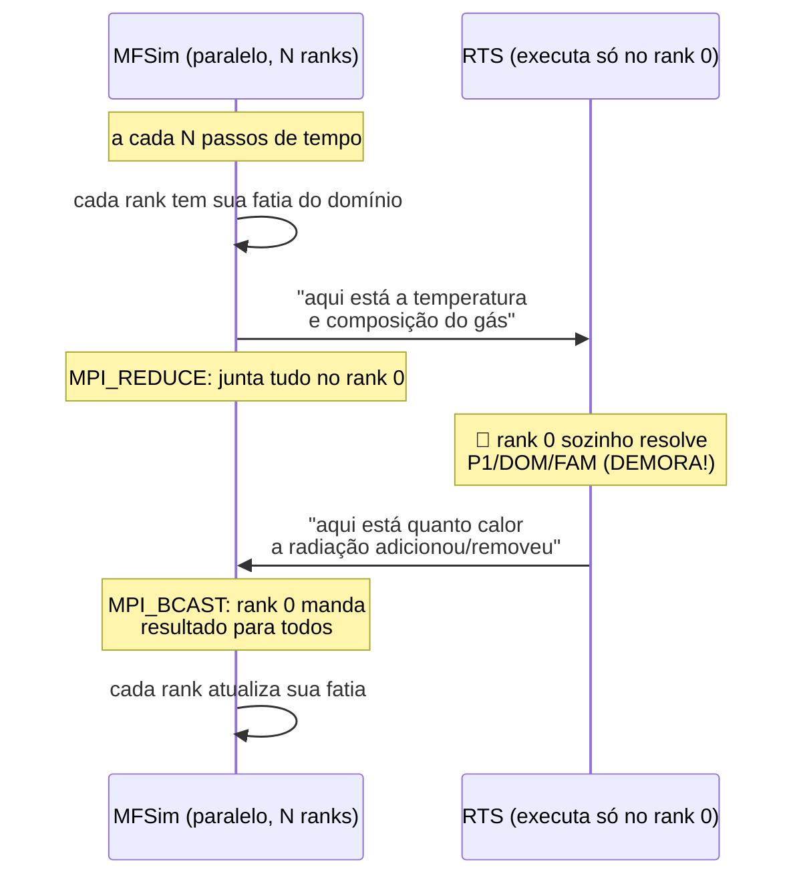
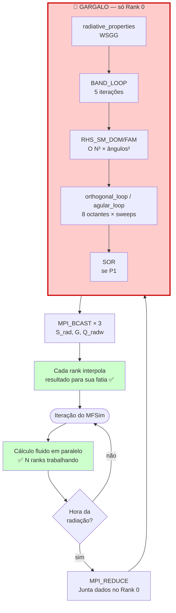

# 00 — Começa Aqui (Guia para quem nunca viu o problema)

> **Para quem é este documento:** você é programador(a), foi chamado(a) para ajudar a otimizar
> esse código Fortran, e ninguém te explicou direito o que ele faz, por que existe, ou o que
> são essas palavras todas (radiação, RTE, DOM, FAM, WSGG, MFSim, AMR...). Este doc é o
> "explica como se eu tivesse 5 anos" — sem fórmulas, sem física avançada, focado em dar
> intuição suficiente para você ler os outros documentos sem se perder.
>
> Tempo de leitura: ~20 min.

---

## 1. O Mundo Real Por Trás do Código

### 1.1 O problema que querem resolver

Imagine projetar uma **câmara de combustão** (tipo a de um motor de avião ou uma caldeira
industrial). Você precisa saber:

- Quão quente cada região fica
- Como o calor se espalha
- Onde a parede vai ficar mais quente (e talvez derreter)
- Se a chama é eficiente

Para isso, engenheiros usam **simulações no computador** ao invés de construir e testar
fisicamente cada protótipo (caro e demorado). Esse tipo de simulação é chamado de
**CFD** (Computational Fluid Dynamics — Dinâmica dos Fluidos Computacional).

### 1.2 As 3 formas de calor que importam

Calor se move de **três maneiras**:

| Forma | Como funciona | Exemplo do dia a dia |
|-------|---------------|---------------------|
| **Condução** | Calor passa por contato sólido | Cabo de panela esquentando |
| **Convecção** | Calor é levado pelo fluido em movimento | Ar quente subindo |
| **Radiação** | Calor viaja como onda eletromagnética (sem precisar de meio) | Sol esquentando você, mesmo no vácuo |

Em uma chama, **a radiação domina** (chega a ser 90% da transferência de calor a altas
temperaturas). Por isso ela é tão importante de simular.

### 1.3 Por que radiação é difícil de simular

Condução e convecção dependem **só do vizinho imediato** (a célula ao lado).
Radiação é o pesadelo: cada pedacinho de gás **emite raios em todas as direções ao
mesmo tempo**, e esses raios viajam por todo o domínio antes de serem absorvidos.

> 💡 **Analogia para programador:** condução é tipo um *grafo onde cada nó só fala com
> seus vizinhos diretos*. Radiação é tipo um *grafo totalmente conectado* — toda célula
> potencialmente interage com toda outra célula. Por isso o custo computacional explode.

---

## 2. Como Computadores "Simulam" Algo Físico

Antes de falar de radiação especificamente, três conceitos universais de qualquer
simulação física:

### 2.1 Malha (mesh / grid)

Você não consegue calcular a temperatura em **todos os infinitos pontos** de uma câmara —
o computador é finito. Então você divide o espaço em **caixinhas pequenas (células)**:

```
Câmara real (contínua)        Malha computacional (discreta)
┌──────────────┐              ┌──┬──┬──┬──┬──┐
│              │              ├──┼──┼──┼──┼──┤
│   ~ chama ~  │     →        ├──┼──┼──┼──┼──┤
│              │              ├──┼──┼──┼──┼──┤
└──────────────┘              └──┴──┴──┴──┴──┘
```

Em código isso vira um **array 3D**: `T(i,j,k)` é a temperatura na caixinha de coordenadas
`(i,j,k)`. No RTS isso é literalmente `T_energy(nxi, nyi, nzi)`.

> 🧠 Mais células = simulação mais precisa, mas tempo de computação cresce **cúbico**
> (dobrar a resolução = 8× mais células = pelo menos 8× mais tempo).

### 2.2 Equação diferencial → sistema linear

A física fundamental aparece como **equações diferenciais** (relações entre temperatura,
suas derivadas, propriedades do gás...). O computador não resolve cálculo simbólico —
ele transforma isso num **sistema de equações lineares gigante**:

```
A · x = b
```

onde `A` é uma matriz enorme (uma linha por célula), `x` é o vetor com as temperaturas
desconhecidas, `b` tem as condições conhecidas. Resolver esse sistema é o trabalho dos
**solvers** (SOR, Jacobi, Gauss-Seidel, CG, GMRES — você já deve ter ouvido).

### 2.3 Iterar até convergir

Como o sistema é gigante e não-linear, ele é resolvido **iterativamente**:

```
chuta valores iniciais
repita:
    calcula novos valores baseados nos antigos
    erro = |novo - antigo|
    se erro < tolerância: para
```

Quando você vê `ITMAX`, `rad_tol`, `res_rad` no código — é isso.

---

## 3. A Equação da Transferência Radiativa (RTE) sem matemática

A **RTE** é a equação fundamental do problema. Em palavras:

> "A intensidade de radiação numa direção, num ponto, muda porque:
>  - **gás absorve** parte dela (vira calor)
>  - **gás emite** novos raios (porque está quente)
>  - **gás espalha** raios que vinham de outras direções para esta direção"

A variável-chave é `I(x, y, z, direção)` — **intensidade radiativa** num ponto e numa
direção. Note a dimensão extra: **direção**. Isso é o que faz radiação ser cara — não basta
saber valores em (x,y,z); precisa saber também em cada direção do espaço.

### 3.1 Por que "direção" é uma dimensão extra

Pense num cubo de gás quente. Ele emite raios em **todas as direções** (4π esferorradianos).
Para resolver a RTE você precisa "saber" o que vai em cada direção:

```
em 3D contínuo:  I(x, y, z, θ, φ)       ← 5 dimensões
em código:       IG(i, j, k, l, m)      ← array 5D
                          └─┴─ índices angulares
```

No RTS, `IG` é literalmente esse array 5D. Em casos grandes (256³ × 128 direções) ele tem
**bilhões de elementos** → ocupa dezenas de GB. **É a maior estrutura de dados do código**
e o motivo principal pelo qual paralelizar virou prioridade.

---

## 4. Os Três Métodos do RTS (P1, DOM, FAM)

Existem **3 jeitos diferentes** de resolver a RTE. O RTS implementa todos. Você escolhe
no input.rts qual usar conforme o caso.

### 4.1 P1 — o aproximado e rápido

**Ideia:** assume que a radiação se espalha de forma quase isotrópica (igual em todas as
direções). Transforma a RTE numa equação mais simples (elíptica, parecida com Laplace).

- ✅ Rápido, usa pouca memória
- ❌ Impreciso em meios "opticamente finos" (pouco gás, raios atravessam reto sem
  interagir)
- Usa o solver **SOR** internamente

**Quando usar:** estimativa rápida, gases muito opacos, primeira aproximação.

### 4.2 DOM — Discrete Ordinates Method

**Ideia:** "Eu não vou rastrear todas as direções possíveis (infinitas). Vou escolher umas
poucas direções representativas (chamadas **ordenadas**) e calcular `I` só nelas. Depois
somo com pesos para reconstruir o total."

- Direções vêm de tabelas pré-calculadas (S_N de Fiveland, T_N de Thurgood, Q_N de Wei)
- Tipicamente 24 a 80 direções
- ✅ Boa precisão para geometrias retangulares
- ❌ Sofre de "efeitos de raio" (artefatos onde a radiação parece "vir só de algumas
  direções")

### 4.3 FAM — Finite Angle Method

**Ideia:** "Vou dividir a esfera de direções em **caixinhas angulares** uniformes (em
θ polar e φ azimutal), igualzinho como divido o espaço em caixinhas (x,y,z)."

- Discretização `nt × np` (típico: 8 × 16 = 128 direções)
- ✅ Mais preciso que DOM, melhor com espalhamento
- ❌ Mais caro computacionalmente, especialmente com espalhamento

**Quando usar:** quando precisa de precisão e tem espalhamento (fuligem, gotículas).

### 4.4 O conceito de "sweep" (varredura)

Em DOM e FAM, **resolver uma direção** significa percorrer o domínio nessa direção.
Se a radiação vem do "oeste" (direção +x), você varre da esquerda pra direita, porque
o valor numa célula depende da célula imediatamente a oeste (que já foi calculada):

```
Direção +x:
  vai computando →→→→→→→→
  ┌──┬──┬──┬──┬──┬──┐
  │ 1│ 2│ 3│ 4│ 5│ 6│   ← cada célula precisa do valor da esquerda
  └──┴──┴──┴──┴──┴──┘    (dependência sequencial!)
```

Como tem 8 octantes (combinações de sinais ±x, ±y, ±z), isso é repetido 8 vezes
por iteração. Os 8 sweeps são **independentes entre si**, mas dentro de cada sweep há
**dependência sequencial** (cada célula precisa da anterior). Isso é o que torna
paralelização não-trivial — você verá isso explicado nos próximos docs.

---

## 5. WSGG — Por que o gás absorve de forma "esquisita"

### 5.1 Gás cinza vs gás real

Um gás "cinza" absorve **igualmente em todas as frequências** de luz. É uma simplificação
matemática útil mas pouco realista.

Gases reais (CO₂, H₂O) são **seletivos**: absorvem muito em certas bandas (faixas de
comprimento de onda) e quase nada em outras. Imagina o gráfico de absorção como um
*espectro* cheio de picos.

### 5.2 WSGG — Weighted Sum of Gray Gases

Modelar exatamente esse espectro custaria tempo absurdo. **WSGG** é um truque:

> "Vou fingir que o gás real é uma mistura de **5 gases cinzas fictícios**, cada um com
> uma 'cor' diferente, ponderados por coeficientes calibrados experimentalmente."

Aí o código resolve **5 problemas de gás cinza independentes** (chamados "bandas" ou
`IBND = 1..5`) e soma com pesos. Essas 5 bandas são **independentes entre si** — o que
significa que você pode resolvê-las em paralelo (que é a Opção 1 do relatório).

### 5.3 Cinza vs não-cinza no RTS

| Modo | Quando | Custo |
|------|--------|-------|
| `nongray_flag = .false.` | gás "cinza", caso acadêmico | 1× |
| `nongray_flag = .true.` (WSGG) | gás real (CO₂/H₂O combustão) | 5× (loop de bandas) |

Por isso casos realistas de combustão são 5× mais caros.

---

## 6. O Que é o MFSim?

### 6.1 Resumo de uma linha

**MFSim** é um **simulador CFD desenvolvido pelo MFLab da UFU** que simula o fluido
(velocidade, pressão, temperatura, combustão). É um código grande, em produção, e
já é **paralelo via MPI**.

### 6.2 O que MFSim faz e o que NÃO faz

| Faz | Não faz bem (sozinho) |
|-----|----------------------|
| Velocidade do fluido | Radiação térmica |
| Pressão | Espectro do gás |
| Temperatura por condução/convecção | Direções de propagação de raios |
| Reações químicas | Geometria angular |

Para a parte radiativa, o MFSim **chama o RTS como módulo externo**. Esse é o
"acoplamento" que o relatório descreve.

### 6.3 Por que separar?

Filosofia de software clássica: **separação de responsabilidades**. CFD e radiação são
problemas distintos com técnicas distintas. Fazendo módulos separados:

- Cada um pode ser desenvolvido por especialistas diferentes
- O RTS pode ser reutilizado por outros CFDs (não só MFSim)
- Bugs e otimizações em radiação ficam isoladas

> 💡 É a mesma razão pela qual sua aplicação web não implementa o próprio sistema de
> banco de dados — usa Postgres. Aqui MFSim "usa" RTS como Postgres da radiação.

### 6.4 AMR — Adaptive Mesh Refinement (pra contextualizar)

MFSim usa malha **adaptativa**: regiões interessantes (ex.: dentro da chama) têm
células pequenas, regiões "chatas" (ar parado longe) têm células grandes. Isso é o
**AMR**. RTS, por contraste, usa malha **uniforme** (todas as células do mesmo tamanho).

Por isso existe um passo de **interpolação** entre as duas: você precisa traduzir
campos da malha do MFSim para a malha do RTS e vice-versa.

---

## 7. Como MFSim e RTS Conversam Hoje

### 7.1 O fluxo simplificado



### 7.2 Em termos de programador

Hoje a integração funciona assim, simplificando:

```python
# Pseudocódigo do que acontece nos ranks MFSim
def mfsim_step():
    # ... cálculos do MFSim em paralelo ...

    if hora_de_resolver_radiacao:
        # Junta os dados no rank 0
        T_global = MPI_REDUCE(T_local, root=0, op=SUM)

        if rank == 0:
            # SÓ O RANK 0 RODA O RTS — todos os outros ficam parados ⏳
            S_rad_global, G_global, Q_wall = rts.solve(T_global)
        else:
            S_rad_global = None
            G_global = None
            Q_wall = None

        # Distribui resultado para todos
        S_rad_global = MPI_BCAST(S_rad_global, root=0)
        # ... etc

        # Cada rank pega sua fatia
        S_rad_local = pega_minha_fatia(S_rad_global)
```

**O problema gritante:** se o MFSim roda em 128 cores, durante o `rts.solve()` os 127
cores ficam ociosos enquanto 1 core faz todo o trabalho. Em casos pesados, isso pode
ser **a maior parte do tempo total**.

---

## 8. Por que Querem Que Você Otimize Isso

### 8.1 Os 3 problemas concretos

| Problema | Quem sente | Sintoma |
|----------|-----------|---------|
| **Tempo** | Pesquisador esperando resultado | Simulação demora dias |
| **Memória** | Sistema | Estoura RAM em casos 256³ (~90 GB de IG) |
| **Escalabilidade** | Cluster ocioso | Mais cores não ajuda |

### 8.2 As soluções possíveis (em linguagem de programador)

| Abordagem | O que é, em código | Esforço |
|-----------|-------------------|---------|
| **OpenMP** | `#pragma omp parallel for` no Fortran (`!$OMP`) | Baixo |
| **MPI** | `MPI_Send`/`MPI_Recv` entre processos | Alto |
| **GPU** | Reescrever em CUDA/OpenACC | Muito alto |

Para nós: queremos primeiro **OpenMP** (acelera dentro de um nó) e depois **MPI por
decomposição de domínio** (acelera entre nós). É o que os outros docs vão descrever.

---

## 9. Glossário de Programador

Tradução dos termos físicos para conceitos que você já conhece:

| Termo físico | "Tradução" mental |
|--------------|-------------------|
| **Radiação térmica** | Calor que viaja como onda de luz |
| **RTE** | A equação central que precisa ser resolvida |
| **Intensidade `I` ou `IG`** | Quanta energia vai em cada direção (array 5D) |
| **Incidência `G`** | Soma de `I` sobre todas as direções (array 3D) |
| **`S_rad` (fonte radiativa)** | Quanto calor a radiação adicionou/tirou de cada célula |
| **Coeficiente de absorção `κ` (cappa)** | Quanto o gás "bebe" da radiação |
| **Coeficiente de espalhamento `σ` (sigma)** | Quanto o gás "redireciona" raios |
| **Octante** | Um dos 8 quadrantes 3D (sinais ±x, ±y, ±z) |
| **Sweep / varredura** | Loop que percorre o domínio em uma direção |
| **Quadratura** | Tabela pré-calculada de direções + pesos para somar |
| **Banda espectral** | Faixa de frequência (no WSGG, são 5) |
| **Cinza** | Modelo simplificado (mesma absorção em toda frequência) |
| **Não-cinza** | Modelo realista (absorção depende da frequência) |
| **Domínio computacional** | A região 3D simulada (em código: o array 3D) |
| **Halo / ghost cells** | Camada de cópia de borda usada em MPI |
| **Acoplamento** | MFSim chama RTS e vice-versa |
| **AMR** | Malha com regiões mais refinadas que outras |
| **Wavefront / KBA** | Padrão de paralelização para sweeps |
| **WSGG** | Truque para modelar gás real como 5 gases fictícios |
| **DOM / FAM / P1** | Três métodos diferentes de resolver a RTE |

---

## 10. Quem é Quem nos Arquivos do RTS (versão simplificada)

Os arquivos em `sources/` agrupados por papel:

```
🏁 ENTRADA
  RTS_main.f90       ← programa principal (20 linhas úteis)
  RTS_input.f90      ← lê os .rts da pasta input/
  RTS_start.f90      ← aloca tudo, monta malha
  RTS_global.f90     ← variáveis globais (banco de dados central)

🔧 INFRAESTRUTURA
  RTS_solvers.f90    ← SOR, Jacobi, normas
  RTS_bc.f90         ← condições de contorno (paredes)
  RTS_scattering.f90 ← funções de espalhamento (Mie, Rayleigh, etc.)
  RTS_absorption.f90 ← WSGG (5 bandas)
  RTS_functions.f90  ← funções customizáveis pelo usuário

🧠 NÚCLEO (o que importa pra otimização)
  RTS_radiation.f90  ← P1, DOM, FAM — onde o tempo gasta
  RTS_energy.f90     ← equação da energia (se ativada)

📤 SAÍDA
  RTS_output.f90     ← VTK, .dat, slices
```

---

## 11. Pra Onde Ir Agora

Agora você está pronto para os outros docs sem ficar perdido:

1. **[01-arquitetura-atual.md](01-arquitetura-atual.md)** — destrincha arquivo por
   arquivo do RTS, com fluxograma e análise técnica
2. **[02-relatorio-mfsim-mpi.md](02-relatorio-mfsim-mpi.md)** — síntese do relatório
   técnico da equipe (com pseudocódigo da estratégia MPI recomendada)
3. **(futuros)** — implementação propriamente dita

---

## 12. Resposta a Perguntas Frequentes

**P: Eu preciso entender a física pra otimizar o código?**
R: Não. Você precisa entender o **fluxo de dados** (quem lê o quê, quem escreve o quê,
quem depende de quem). A física só importa para não introduzir bugs sutis (ex.: trocar
a ordem de um loop pode quebrar a propagação da radiação). Sempre que tiver dúvida,
pergunta — não chuta no físico.

**P: Posso simplesmente colocar `!$OMP PARALLEL DO` em todos os loops?**
R: Não. Loops com dependência (sweeps, SOR) vão dar resultado **errado** silenciosamente.
A regra é: paraleliza só onde cada iteração é independente das outras. Vamos discutir
isso caso a caso.

**P: Por que Fortran e não C/C++/Python?**
R: Fortran é o padrão histórico para HPC numérico. Compiladores Fortran são extremamente
bons em otimizar loops aninhados e arrays multidimensionais. A comunidade científica
(CFD, clima, astrofísica) ainda usa Fortran em produção. Aceita e segue em frente.

**P: Vou ter que aprender Fortran?**
R: Um pouco. A sintaxe é simples (`do/end do`, `if/then/end if`, `subroutine`). O que
muda mental é: arrays começam em 1 (não 0), `(i,j,k)` é column-major (oposto de C).

**P: O código tá com um zilhão de variáveis globais. Isso é normal?**
R: Em Fortran científico antigo, infelizmente sim. O `module global` no `RTS_global.f90`
funciona como um "Singleton gigante". Não vamos refatorar isso agora — vamos conviver e
ter cuidado com escopo na paralelização.

**P: O que eu faço se travar?**
R: Pergunta. O domínio é especializado, mas qualquer dúvida que surgir provavelmente já
foi resolvida antes — seja pela equipe, seja pela literatura de transporte de nêutrons
(que enfrenta o mesmo problema matemático desde os anos 70).

---

---

## 13. Resumo Visual — Como Funciona Hoje e Onde Está o Problema

Esta seção fecha o documento amarrando tudo num único quadro mental. Se você lembrar só
desta parte, já consegue acompanhar as discussões técnicas.

### 13.1 Os atores

```
┌─────────────────────────────────────────────────────────────────┐
│                          O SISTEMA                              │
├─────────────────────────────────────────────────────────────────┤
│                                                                 │
│  MFSim (CFD)                          RTS (radiação)            │
│  ───────────                          ────────────              │
│  • Já paralelo (MPI)                  • Serial (1 core só)      │
│  • Domínio dividido entre N ranks     • Recebe tudo de uma vez  │
│  • Malha adaptativa (AMR)             • Malha uniforme          │
│  • Calcula fluido, temperatura        • Calcula radiação        │
│  • Roda continuamente                 • Chamado de N em N passos│
│                                                                 │
│        └─────── conversam via ───────┘                          │
│                                                                 │
│        rad_core.f90 / RTS_connection.f90 / rad_interface.f90    │
│        (camada de cola dentro do MFSim)                         │
│                                                                 │
└─────────────────────────────────────────────────────────────────┘
```

### 13.2 Como funciona hoje (timeline)

```mermaid
gantt
    title Timeline de uma execução típica do MFSim com RTS
    dateFormat X
    axisFormat %s

    section Rank 0
    MFSim paralelo            :active, r0a, 0, 10
    Coleta dados (REDUCE)     :crit, r0b, 10, 12
    RTS solver (SOZINHO)      :crit, r0c, 12, 30
    Envia resultado (BCAST)   :crit, r0d, 30, 32
    MFSim paralelo            :active, r0e, 32, 42

    section Rank 1
    MFSim paralelo            :active, r1a, 0, 10
    Manda dados ao root       :crit, r1b, 10, 12
    OCIOSO esperando          :done, r1c, 12, 30
    Recebe resultado          :crit, r1d, 30, 32
    MFSim paralelo            :active, r1e, 32, 42

    section Rank 2
    MFSim paralelo            :active, r2a, 0, 10
    Manda dados ao root       :crit, r2b, 10, 12
    OCIOSO esperando          :done, r2c, 12, 30
    Recebe resultado          :crit, r2d, 30, 32
    MFSim paralelo            :active, r2e, 32, 42

    section Rank N
    MFSim paralelo            :active, rNa, 0, 10
    Manda dados ao root       :crit, rNb, 10, 12
    OCIOSO esperando          :done, rNc, 12, 30
    Recebe resultado          :crit, rNd, 30, 32
    MFSim paralelo            :active, rNe, 32, 42
```



> **Leia o gráfico assim:**
> - 🟢 **Verde** = trabalho útil (todo mundo trabalhando)
> - 🟡 **Amarelo** = comunicação (cara, mas necessária)
> - ⚫ **Cinza/branco** = OCIOSO — cores parados esperando o Rank 0 terminar
>
> Repare que durante o RTS solver (o bloco mais longo), **só o Rank 0 está trabalhando**.
> Em um cluster de 128 cores, 127 ficam parados.

### 13.3 Visão espacial do problema

```
ETAPA 1: MFSim rodando (todos trabalham em paralelo) ✅

  Domínio físico (ex.: câmara de combustão 3D)
  ┌───────┬───────┬───────┬───────┐
  │ R0 🔥 │ R1 🔥 │ R2 🔥 │ R3 🔥 │  ← cada rank tem sua fatia
  ├───────┼───────┼───────┼───────┤     e calcula o fluido nela
  │ R4 🔥 │ R5 🔥 │ R6 🔥 │ R7 🔥 │
  └───────┴───────┴───────┴───────┘
  Tempo: rápido (paralelo)


ETAPA 2: hora da radiação → manda tudo pro Rank 0 😰

  ┌───────┐                ┌───────────────────────────────┐
  │ R0 🔥 │ ──┐            │                               │
  ├───────┤   │            │       DOMÍNIO INTEIRO         │
  │ R1 🔥 │ ──┼──REDUCE──> │       reconstruído            │
  ├───────┤   │            │       no Rank 0               │
  │  ...  │ ──┘            │                               │
  └───────┘                └───────────────────────────────┘
  Rank 1..N: agora OCIOSOS 😴


ETAPA 3: Rank 0 sozinho resolve RTS 🐢

  ┌────────────────────────────────────────────────┐
  │                                                │
  │  Rank 0 executa:                               │
  │    - WSGG (5 bandas)                           │
  │    - DOM ou FAM (8 octantes × ~128 direções)   │
  │    - Sweeps espaciais sequenciais              │
  │    - Iterações até convergir                   │
  │                                                │
  │  Aloca IG(nxi,nyi,nzi,nt,np) — pode dar 90 GB! │
  │                                                │
  │  Outros ranks: 😴 😴 😴 😴 😴 😴 😴             │
  │                                                │
  └────────────────────────────────────────────────┘
  Tempo: LENTO (serial)


ETAPA 4: manda resultado pra todo mundo (BCAST)

  ┌───────────────────────────────┐
  │                               │ ──┐
  │       S_rad, G, Q_radw        │   │              ┌───────┐
  │       no Rank 0               │ ──┼──BCAST────> │ R0..N │
  │                               │   │              └───────┘
  └───────────────────────────────┘ ──┘

ETAPA 5: volta ao MFSim em paralelo (volta ao normal) ✅
```

### 13.4 Onde exatamente está o problema (mapa)



### 13.5 Os 3 problemas concretos, lado a lado

| Problema | Onde acontece | Sintoma observável | Quem sofre |
|----------|---------------|--------------------|-----------| 
| 🐢 **Tempo** | `rtesolve` no Rank 0 | Simulação demora horas/dias | Pesquisador |
| 💾 **Memória** | `allocate(IG)` em TODO rank | RAM estoura em casos grandes (até 90 GB) | Sistema |
| 📉 **Não escala** | `rtesolve` é serial | Adicionar mais cores não acelera | Cluster ocioso |

### 13.6 Como queremos que fique (objetivo)

```mermaid
gantt
    title Timeline DEPOIS da paralelização (objetivo)
    dateFormat X
    axisFormat %s

    section Rank 0
    MFSim paralelo            :active, r0a, 0, 10
    Halo exchange             :crit, r0b, 10, 11
    RTS sweep no SEU pedaço   :active, r0c, 11, 18
    Halo exchange             :crit, r0d, 18, 19
    MFSim paralelo            :active, r0e, 19, 29

    section Rank 1
    MFSim paralelo            :active, r1a, 0, 10
    Halo exchange             :crit, r1b, 10, 11
    RTS sweep no SEU pedaço   :active, r1c, 11, 18
    Halo exchange             :crit, r1d, 18, 19
    MFSim paralelo            :active, r1e, 19, 29

    section Rank 2
    MFSim paralelo            :active, r2a, 0, 10
    Halo exchange             :crit, r2b, 10, 11
    RTS sweep no SEU pedaço   :active, r2c, 11, 18
    Halo exchange             :crit, r2d, 18, 19
    MFSim paralelo            :active, r2e, 19, 29

    section Rank N
    MFSim paralelo            :active, rNa, 0, 10
    Halo exchange             :crit, rNb, 10, 11
    RTS sweep no SEU pedaço   :active, rNc, 11, 18
    Halo exchange             :crit, rNd, 18, 19
    MFSim paralelo            :active, rNe, 19, 29
```



> 🟢 **Sem cinza/ocioso!** Todos os ranks trabalham o tempo todo, inclusive durante o RTS.
> A comunicação (amarelo) vira **troca de bordas com vizinhos** (cheap) em vez de
> reunir tudo no Rank 0 (caro).

### 13.7 Comparativo HOJE vs FUTURO

| Aspecto | Hoje | Objetivo |
|---------|------|----------|
| Quem roda RTS | Só Rank 0 | Todos os ranks |
| Dados de entrada | `MPI_REDUCE` (gigante) | Já estão locais |
| Dados de saída | `MPI_BCAST` × 3 (gigante) | Já ficam locais |
| Comunicação RTS | Nenhuma (mas centralizada) | Halo com vizinhos (pequena) |
| Memória `IG` por rank | Domínio inteiro (~90 GB) | Só sua fatia (~1 GB) |
| Tempo do RTS | Não escala | Escala com cores |
| Mudanças no código | (nenhuma) | Refatorar sweeps + halo + ALLREDUCE no resíduo |

### 13.8 TL;DR em três frases

1. **Hoje:** MFSim é paralelo, mas quando precisa de radiação **para tudo e manda 1 core
   resolver sozinho** o domínio inteiro.
2. **Problema:** esse 1 core é o **gargalo** (tempo + memória + não escala).
3. **Solução:** fazer o RTS também ser paralelo — cada core resolve a radiação da **sua
   fatia espacial**, igualzinho o MFSim já faz com o fluido.

---

*Documento escrito como onboarding para alguém com forte background em programação mas
zero familiaridade com radiação térmica, CFD ou o ecossistema MFSim.*
