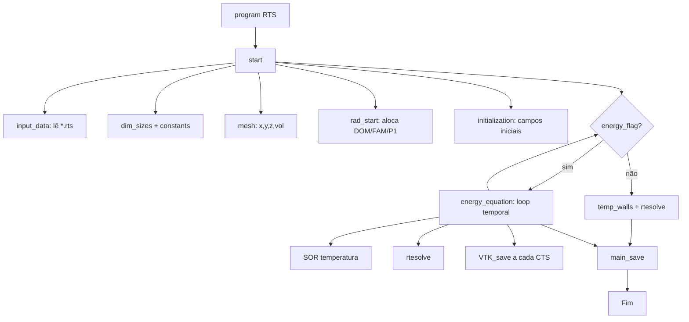
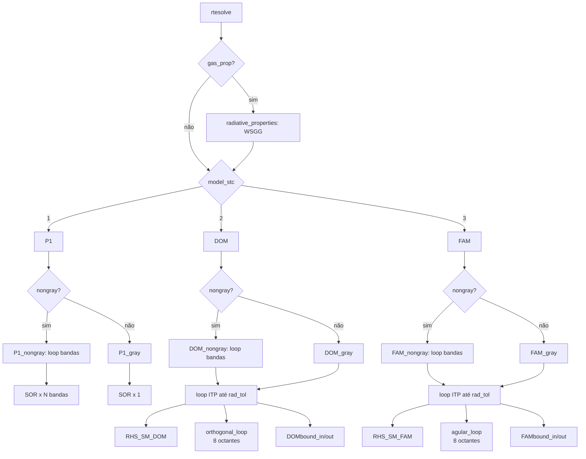
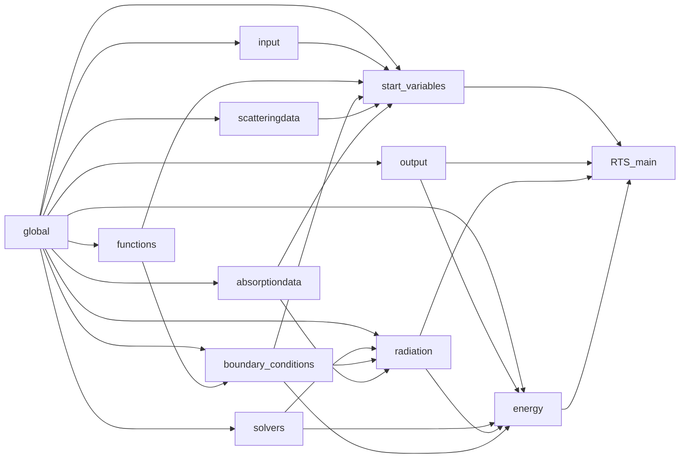

# 01 — Arquitetura Atual do RTS

> Documento inicial: levantamento completo do código existente antes de qualquer modificação.
> Cobre o que o RTS faz, como cada arquivo contribui, qual é o fluxo de execução e onde estão
> os gargalos de performance que motivam o trabalho de paralelização.

> **⚠️ Contexto importante:** este documento analisa o **RTS standalone** (este repositório).
> O RTS, na prática, é distribuído como **módulo de fonte radiativa dentro do MFSim**
> (simulador de mecânica dos fluidos com AMR e MPI). Existe ali um wrapper
> (`src_term/RTS/rad_core.f90`, `RTS_connection.f90`, `rad_interface.f90`) que hoje executa o
> RTS apenas no rank root. Os arquivos analisados aqui (`sources/RTS_*.f90`) são incluídos
> integralmente nessa integração — portanto qualquer paralelização feita aqui beneficia
> diretamente o MFSim. Para a análise do acoplamento e das estratégias específicas
> recomendadas pela equipe, ver [02-relatorio-mfsim-mpi.md](02-relatorio-mfsim-mpi.md).

---

## 1. Visão Geral

O **RTS — Radiative Transfer Simulator** é um simulador escrito em **Fortran (gfortran 10.1+)**
para resolver a **Equação de Transferência Radiativa (RTE)** em meios participantes
(absorvedores, emissores e espalhadores).

Aplicações típicas:
- Câmaras de combustão (gases CO₂/H₂O via WSGG)
- Cavidades com paredes radiantes
- Validação contra benchmarks da literatura (Kim, Shah, Hsu, Bordbar, Goutiere, Soucasse)

### Funcionalidades principais

| Categoria | Capacidades |
|-----------|-------------|
| **Dimensão** | 1D, 2D, 3D |
| **Métodos de solução da RTE** | P1, DOM (Discrete Ordinates), FAM (Finite Angle Method) |
| **Quadraturas DOM** | S_N (Fiveland), T_N (Thurgood), Q_N (Wei) |
| **Modelo espectral** | Gray (cinza) ou Non-gray via WSGG (5 bandas) |
| **Espalhamento** | Isotrópico, Linear, Mie, Rayleigh, Henyey-Greenstein |
| **Esquema espacial** | Upwind (FOU) ou CDS |
| **Equação da energia** | Acoplamento opcional radiação ↔ condução transiente |
| **Malha** | Cartesiana uniforme ou refinada por "paths" |
| **Saída** | VTK, .dat, slices, lineups, custom walls, Nusselt |

### Stack atual

- Linguagem: **Fortran 90/95** puro
- Compilador: **gfortran**
- Paralelismo: **nenhum** — execução serial em uma única thread
- Build: `makefile` simples na raiz

---

## 2. Estrutura de Diretórios

```
RTS/
├── makefile                # Build (gfortran)
├── README.md
├── RTS.jpg
├── .gitignore
│
├── sources/                # Código fonte (.f90)
│   ├── RTS_main.f90        # programa principal
│   ├── RTS_global.f90      # módulo de variáveis globais
│   ├── RTS_input.f90       # leitura dos arquivos .rts
│   ├── RTS_start.f90       # setup inicial (malha, alocações)
│   ├── RTS_functions.f90   # funções de inicialização por usuário
│   ├── RTS_bc.f90          # condições de contorno
│   ├── RTS_scattering.f90  # funções de fase de espalhamento
│   ├── RTS_absorption.f90  # propriedades radiativas dos gases (WSGG)
│   ├── RTS_solvers.f90     # solvers lineares (SOR, Jacobi) + normas
│   ├── RTS_radiation.f90   # núcleo: P1, DOM, FAM
│   ├── RTS_energy.f90      # equação da energia (acoplamento)
│   └── RTS_output.f90      # exportação VTK/dat/slices
│
├── input/                  # Arquivos de entrada (parâmetros)
│   ├── input.rts           # geometria, método, gases
│   ├── energy.rts          # parâmetros térmicos
│   ├── output.rts          # variáveis a salvar
│   └── paths.rts           # refino de malha (opcional)
│
├── validation/             # Casos de validação contra benchmarks
│   ├── 1D_Bordbar_WSGG/
│   ├── 2D_Goutiere_flame/
│   ├── 2D_Kim_scattering/
│   ├── 2D_Shah_solution/
│   ├── 3D_Bordbar_flame/
│   ├── 3D_Hsu_benchmark/
│   ├── 3D_Soucasse_cavity/
│   └── demonstrations/
│
├── refs/                   # Referências (PDFs)
│   ├── Tese03082023 - gustavo-1.pdf
│   └── relatorio_RTS_MFSim_MPI_260308_031011.pdf
│
└── docs/                   # Documentação do trabalho de paralelização
    └── 01-arquitetura-atual.md  ← este documento
```

---

## 3. Descrição dos Arquivos Fonte

Cada arquivo é um **módulo Fortran** (`module ... end module`). A ordem abaixo segue a
ordem de compilação declarada no `makefile`.

### 3.1 `RTS_global.f90` — módulo `global`

**Função:** banco de dados central. **Não tem rotinas computacionais** — apenas
declara todas as variáveis compartilhadas entre módulos (mesh, campos físicos,
flags de configuração, constantes).

**Categorias de variáveis declaradas:**

| Grupo | Exemplos | Tipo |
|-------|----------|------|
| Constantes | `boltz`, `PI`, `PI4`, `small`, `big` | `double precision` |
| Solver | `ITMAX`, `rad_tol`, `res_rad`, `dt`, `cpu_time_*` | escalares |
| Malha | `nx,ny,nz`, `nxi,nyi,nzi`, `lx,ly,lz`, `x,y,z,xc,yc,zc,dxp,dyp,dzp`, `vol` | arrays alocáveis |
| Campos físicos | `T_energy`, `G`, `S_rad`, `cappa`, `sigma`, `beta`, `IBlack`, `K_term`, `Q_radw` | `(nxi,nyi,nzi)` |
| Boundary | `a_b*`, `b_b*`, `g_b*` (T e G), `epsilon_rad`, `wall_temp`, `SBCwall` | bordas |
| DOM | `mux`, `etay`, `xiz`, `Wq`, `Axd`, `Ayd`, `Azd`, `phase_d` | quadraturas |
| FAM | `theta`, `phi`, `dco`, `dcx,dcy,dcz`, `Ax,Ay,Az`, `volom`, `phase_f` | ângulos |
| Não-cinza | `BBF`, `cappaBND`, `GBND`, `IGBND` (dimensão extra `nsb`) | bandas |
| WSGG | `d_wgh`, `b_wgh`, `c_wgh`, `Lm` | polinômios |
| I/O | `vtk_flag`, `dat_flag`, `Rec_flag`, `crec_flag`, `slc_*`, `lnp_*` | flags |

> **Importância para paralelização:** todas as variáveis são `module variables` →
> em OpenMP serão **shared** por default; em MPI cada rank precisará alocar apenas
> sua sub-fatia desses arrays.

---

### 3.2 `RTS_input.f90` — módulo `input`

**Função:** leitura e validação dos arquivos `input/*.rts`.

**Rotinas principais:**
- `input_data` — lê `input.rts` (geometria, método, gases) usando `read(60,*)` sequencial
- `input_paths` — lê `paths.rts` (refino opcional)
- `input_energy` — lê `energy.rts` (parâmetros térmicos)
- `recorded_variables` — lê `output.rts` (o que salvar)
- `internal_input` — converte strings (`'DOM'`, `'WSGG'`, ...) em códigos inteiros (`model_stc`, `absrp_stc`, ...)
- `the_sanity_checks` — bateria de validações (dimensões, ordens de quadratura, contornos) → grava `output/RTS.log`

**Custo computacional:** trivial. Roda uma vez no início.

---

### 3.3 `RTS_start.f90` — módulo `start_variables`

**Função:** orquestra o setup. Chama na ordem:

```
input_data → dim_sizes → constants → mesh → rad_start → initialization
```

**Rotinas-chave:**
- `start` — ponto de entrada chamado pelo `main`
- `mesh` — constrói grids `x,y,z`, centros `xc,yc,zc`, `dxp,dyp,dzp`, volume `vol(i,j,k)`
- `pathfinder` — refinamento não-uniforme em torno de paths
- `rad_start` — aloca arrays radiativos conforme método (P1/DOM/FAM) e modelo (gray/non-gray)
- `angular_grid` (FAM) — divide θ ∈ [0,π], φ ∈ [0,2π] em `nt × np` ângulos sólidos; calcula `dco`, `dcx`, `dcy`, `dcz`, `volom`
- `angular_indexes` — define índices divisores `P2,P3,P4,T2` (octantes)
- `angular_coefficients` (FAM) — `Ax(j,k,l,m) = |dcx|·dy·dz` e análogos
- `quadrature_sets` (DOM) — seleciona S_N/T_N/Q_N e popula `mux,etay,xiz,Wq`
- `Sn_sets` — tabelas hardcoded de Fiveland (S2 a S10)
- `Tn_sets` — Thurgood (subdivisão recursiva de triângulos esféricos)
- `Qn_sets` — Wei (longitude × latitude)
- `orthogonal_coefficients` (DOM) — `Axd(j,k,l) = |μ|·dy·dz` e análogos
- `initialization` — preenche campos via ponteiros de função (`Temp_field`, `G_field`, etc.)

**Custo computacional:** uma vez no início. Não é gargalo.

---

### 3.4 `RTS_functions.f90` — módulo `functions`

**Função:** funções de **inicialização espacial** que o usuário pode customizar
para cada caso de validação (sobrescritas em `validation/*/user_functions.f90`).

Exemplos: `Temp_field(i,j,k)`, `G_field(i,j,k)`, `cappa_field`, `sigma_field`,
`Kterm_field`, `Pk_field`, `Y_CO2field`, `Y_H2Ofield`.

São chamadas pela `initi_func` em `RTS_start.f90`.

---

### 3.5 `RTS_bc.f90` — módulo `boundary_conditions`

**Função:** monta os coeficientes de borda `a_b*`, `b_b*`, `g_b*` para cada parede,
aplicados depois aos sistemas lineares.

**Rotinas-chave:**
- `bound_P1` — coeficientes para o método P1 (envolve `zetaPONE`)
- `bound_temp` — análogo para a equação da energia (BCs Dirichlet/Neumann/Robin via `BC_flags_t`)
- `boundary` — incorpora os coeficientes de borda na matriz `Aw,Ae,...,Ap` antes de chamar o solver
- `wall_properties` — extrapola `G` para os nós-fantasma das paredes
- `emissivity_walls` — propaga `epsilon_w` para o campo `epsilon_rad`
- `zetaPONE` — função auxiliar do P1

**Custo:** O(N²) por face, baixo comparado ao volume.

---

### 3.6 `RTS_scattering.f90` — módulo `scatteringdata`

**Função:** funções de fase de espalhamento Φ(s, s′).

Modelos suportados:
- **Mie** — coeficientes pré-tabelados via série de Legendre (`legendre_phase`)
- **Rayleigh** — Φ = (3/4)(1 + cos²θ)
- **Linear** — Φ = 1 + C·cosθ
- **Henyey-Greenstein** — Φ = (1 − g²) / (1 + g² − 2g·cosθ)^(3/2)

**Rotinas-chave:** `anisotropic_dom`, `anisotropic_fam` — pré-calculam `phase_d(l,l')` e
`phase_f(l,m,l',m')` (chamadas só uma vez no setup).

**Custo:** uma vez no início. Mas `phase_f` é um array 4D (`nt × np × nt × np`) que
**aparece dentro do hot loop** `RHS_SM_FAM`.

---

### 3.7 `RTS_absorption.f90` — módulo `absorptiondata`

**Função:** calcula coeficientes de absorção dependentes da composição do gás.

**Rotinas-chave:**
- `radiative_properties` — popula `cappaBND(i,j,k,IBND)` e `BBF(i,j,k,IBND)`
- `WSGG` — modelo Weighted Sum of Gray Gases para mistura CO₂/H₂O
- `WSGG_polynomials` — carrega coeficientes polinomiais do modelo Bordbar

**Custo:** triplo loop espacial `(i,j,k)`. Médio. Chamada **uma vez** por solução
(ou por passo de tempo se `energy_flag = .true.`).

---

### 3.8 `RTS_solvers.f90` — módulo `solvers`

**Função:** solvers lineares para a equação elíptica e funções de norma.

**Rotinas-chave:**
- `elliptic_coefficients` — monta `Aw,Ae,As,An,Ab,At,Ap` para a discretização VF padrão:
  `Ae·φe + Aw·φw + ... − Ap·φp = RHS`
- `SOR` — **Successive Over-Relaxation** (ω = 1.9). Loop `ITMAX × nz × ny × nx` com
  dependência espacial Gauss-Seidel.
- `JACOBI` — alternativa sem dependência (não usada por default)
- `L1NORM`, `L2NORM`, `ETANORM`, `MAXNORM`, `DIFNORM` — métricas de resíduo

**Custo:** **alto.** O `SOR` é o gargalo do método **P1** e da **equação da energia**.

---

### 3.9 `RTS_radiation.f90` — módulo `radiation` ⭐ NÚCLEO

**Função:** resolve a RTE pelos três métodos disponíveis.
**Este é o módulo mais pesado e o foco principal da paralelização.**

#### Estrutura

```
rtesolve
├── radiative_properties     (se gas_prop)
└── conforme model_stc:
    ├── P1 → P1_gray / P1_nongray
    ├── DOM → DOM_gray / DOM_nongray
    └── FAM → FAM_gray / FAM_nongray
```

#### Método P1

- `P1_gray` / `P1_nongray` — monta `RHS`, `Ap`, ..., chama `SOR`, calcula `S_rad` e fluxos
- Loop de bandas (1..5) para non-gray
- **Hot:** chamada do `SOR` (em `RTS_solvers.f90`)

#### Método DOM (Discrete Ordinates)

- `DOM_gray` / `DOM_nongray` — laço de iteração até `rad_tol`
- `RHS_SM_DOM` — calcula o termo fonte de cada cela:
  - Loops `(k,j,i,m=1..8,l=1..nq)` ⇒ **5 níveis aninhados**
  - Para cada cela: somatório angular sobre `nq` direções com `phase_d`
  - **Sem dependência entre celas** → embaraçosamente paralelo
- `orthogonal_loop` — varredura das 8 octantes (sweep upwind):
  - Para cada octante: loops `(k,j,i,l)` na direção da propagação
  - **Há dependência espacial:** cada cela usa a cela à montante (já calculada)
  - Atualiza `IG(i,j,k,l,m)` e `eps = max(eps, dif)` (reduction-max)
- `DOMbound_in` / `DOMbound_out` — BCs de entrada/saída por face
- `G_DOM` — soma angular: `G(i,j,k) = Σ IG(i,j,k,l,m)·Wq(l)`
- `wall_fluxes_DOM` + função `IGFLUX` — fluxos nas paredes

#### Método FAM (Finite Angle Method)

Estrutura análoga ao DOM, mas a discretização angular é uniforme em (θ, φ):
- `RHS_SM_FAM` — loops `(k,j,i,l=1..nt,m=1..np)` + somatório interno `(ll,mm)` com `phase_f`
  - **Custo dominante:** O(N³ · n_t² · n_p²) no caso anisotrópico
- `agular_loop` — sweep nas 8 octantes (mesma lógica do DOM mas com 2 índices angulares)
- `FAMbound_in` / `FAMbound_out`, `IGSFAM`, `G_FAM`, `wall_fluxes_FAM`, `IGFLUX`

> **Esses dois sweep loops + o RHS_SM_*** são responsáveis pela maior parte do tempo
> de execução em casos 3D realistas.

---

### 3.10 `RTS_energy.f90` — módulo `energy`

**Função:** resolve a equação da energia (condução) acoplada à radiação.

**Rotina principal:** `energy_equation`
- Calcula `dt` por critério de estabilidade explícito
- Monta coeficientes elípticos (chama `elliptic_coefficients`)
- Loop temporal: a cada passo, chama `temp_walls` → `rtesolve` → atualiza `T_energy` via `SOR`
- Salva resultados a cada `CTS` passos

**Custo:** se ativado, multiplica o custo radiativo pelo número de passos no tempo.

---

### 3.11 `RTS_output.f90` — módulo `output`

**Função:** exporta resultados.

**Rotinas-chave:**
- `main_save` — dispatcher conforme as flags
- `VTK_save` — formato VTK (legacy ASCII) para ParaView
- `dat_save` — formato `.dat` simples
- `main_slice` — fatias 2D em planos
- `main_lineup` — perfis 1D ao longo de linhas
- `walls_custom_save` — superfícies das paredes
- `Nusselt_main` — número de Nusselt

**Custo:** I/O. Roda uma vez no final (ou a cada `CTS` se transiente).

---

### 3.12 `RTS_main.f90` — programa principal

Programa de **20 linhas úteis**:

```fortran
call start                  ! setup
call cpu_time(cpu_time_s)
if(energy_flag) then
    call energy_equation    ! acoplado
else
    call temp_walls         ! só BCs térmicas
    call rtesolve           ! RTE pura
end if
call cpu_time(cpu_time_f)
call main_save              ! salva resultados
```

---

## 4. Fluxo de Execução

### 4.1 Diagrama de alto nível



### 4.2 Detalhe de `rtesolve`



### 4.3 Hierarquia de módulos (dependências `use`)



---

## 5. Análise de Performance

### 5.1 Mapa de custo computacional

Para um caso 3D non-gray, FAM com `nt × np = 8 × 16` e malha `100³`:

| Rotina | Complexidade | Quando | Peso relativo |
|--------|-------------|--------|---------------|
| `input_data`, `mesh`, `rad_start` | O(N³) uma vez | setup | desprezível |
| `radiative_properties` (WSGG) | O(N³) | 1×/solução | baixo |
| `RHS_SM_FAM` (anisotrópico) | O(N³ · n_t² · n_p²) | a cada iteração | **alto** |
| `RHS_SM_DOM` (anisotrópico) | O(N³ · n_q²) | a cada iteração | **alto** |
| `agular_loop` / `orthogonal_loop` | O(N³ · n_t · n_p) × 8 octantes | a cada iteração | **muito alto** |
| `SOR` (P1 e energia) | O(N³ · ITMAX_sor) | a cada iteração externa | **alto** |
| `VTK_save` | O(N³) | 1× ou a cada CTS | médio (I/O) |

### 5.2 Hot path observado

Para o método **FAM non-gray**, cada solução completa percorre aproximadamente:

```
BAND_LOOP (1..5)
  └─ ITP_G (1..ITMAX, até convergência)
      ├─ FAMbound_in   ← O(N² · n_t · n_p)
      ├─ RHS_SM_FAM    ← O(N³ · n_t² · n_p²)  ⭐ alvo #1
      ├─ agular_loop   ← O(N³ · n_t · n_p) × 8 ⭐ alvo #2
      └─ FAMbound_out  ← O(N² · n_t · n_p)
```

---

## 6. Problemas e Limitações Identificados

### 6.1 Problema central — execução serial

O código é **100% sequencial**. Em máquinas modernas (8–64 núcleos por CPU) e
em clusters HPC (centenas a milhares de nós), está sub-utilizando recursos.
Casos 3D realistas com WSGG e FAM podem levar **horas a dias**.

### 6.2 Pontos arquiteturais que dificultam paralelização

| # | Problema | Onde | Impacto |
|---|----------|------|---------|
| 1 | **Variáveis globais em todos os módulos** | `RTS_global.f90` | Em MPI exige refatorar para alocações por sub-domínio; em OpenMP por default são `shared`, exigindo `private`/`firstprivate` em vários loops |
| 2 | **Arrays gigantes alocados monoliticamente** | `IG`, `IGBND`, `volom`, `phase_f` | `IG(nxi,nyi,nzi,nt,np)` cresce como N³·n_t·n_p; com WSGG ainda multiplica por `nsb=5`. Pressão sobre cache e memória → MPI por domínio é essencial em casos grandes |
| 3 | **Sweep com dependência upwind** | `agular_loop`, `orthogonal_loop` | Não é embaraçosamente paralelo: cada cela depende do vizinho a montante. Exige técnicas como wavefront / pipeline |
| 4 | **`SOR` Gauss-Seidel** | `RTS_solvers.f90:SOR` | Tem dependência espacial intrínseca. Soluções: red-black ordering, líneas-Jacobi, ou trocar por solver mais paralelizável (GMRES, CG pré-condicionado) |
| 5 | **`(nxi,nyi,nzi)` inclui nós fantasma das paredes** | `RTS_global.f90` | Convenção `[2..nxp]` é interna ao domínio. No MPI, ghost cells dos vizinhos vão **substituir** os fantasmas das paredes nas faces internas — exige atenção |
| 6 | **`ETANORM` divide por `MAXVAL(ruling)`** | `RTS_solvers.f90:299` | Em MPI exige `MPI_ALLREDUCE` (MAX) para o máximo global |
| 7 | **I/O monolítico** | `VTK_save` | Um arquivo único feito por uma thread/processo. Em MPI, considerar VTK paralelo (`.pvtk` + partições por rank) ou escrita via I/O coletivo |
| 8 | **Sem perfilamento** | — | Não existe instrumentação (`gprof`, `Score-P`, `nvprof`). Decisões de paralelização devem começar por medir |
| 9 | **Loop de bandas independente mas com escrita em arrays compartilhados** | `BAND_LOOP` no P1/DOM/FAM non-gray | `G` e `S_rad` são acumulados (`G = G + Gband`). Em OpenMP precisa de `reduction` ou arrays privados; em MPI pode ser distribuído por banda |
| 10 | **`phase_f(nt,np,nt,np)` e `phase_d(nq,nq)`** | `RHS_SM_FAM`, `RHS_SM_DOM` | São lidas dentro do hot loop → boas para cache locality; cuidado para mantê-las read-only em qualquer paralelização |

### 6.3 Problemas menores de qualidade de código

- Comentários repetidos (bloco de licença em todos os arquivos)
- `Wq` é alocado dentro de `Tn_sets`, `Qn_sets` mas sem `deallocate` correspondente em `Oned_quadratures` (potencial vazamento se rechamado)
- Strings de modelo (`'DOM'`, `'P1'`, ...) com múltiplas variantes de capitalização espalhadas em `internal_input`
- `MAXNORM` retorna sem `(intent)` declarado para argumentos
- Mistura de operadores antigos (`.eqv.`, `.eq.`) com modernos (`==`, `>=`)

Estes não são bloqueantes para paralelização, mas valem uma sweep depois.

---

## 7. Estratégias de Paralelização — Visão Geral

> Este capítulo é apenas o **mapa de opções**. Cada estratégia ganhará seu próprio
> documento (`02-...`, `03-...`) com detalhes de implementação e benchmarks.

### 7.1 OpenMP — memória compartilhada

**Quando vale:** uma máquina multi-core (8–128 threads).
**Esforço:** baixo a médio.
**Ganho esperado:** 4–16× em servidor típico.

| Alvo | Estratégia | Dificuldade |
|------|-----------|-------------|
| `RHS_SM_DOM`, `RHS_SM_FAM` | `!$OMP PARALLEL DO COLLAPSE(3)` no loop espacial | 🟢 fácil |
| `BAND_LOOP` (non-gray) | `!$OMP PARALLEL DO PRIVATE(Gband,...) REDUCTION(+:G,S_rad)` | 🟡 média |
| `wall_fluxes_*`, `G_DOM`, `G_FAM` | `!$OMP PARALLEL DO COLLAPSE(2)` | 🟢 fácil |
| `agular_loop`, `orthogonal_loop` | **wavefront diagonal** (`i+j+k = const`) — uma diagonal é paralela | 🔴 difícil |
| `SOR` | red-black ordering | 🟡 média |
| `radiative_properties` (WSGG) | `!$OMP PARALLEL DO COLLAPSE(3)` | 🟢 fácil |

### 7.2 MPI — memória distribuída

**Quando vale:** clusters HPC, problemas muito grandes (N > 256³).
**Esforço:** alto.
**Ganho esperado:** scaling para centenas/milhares de cores.

Decomposição candidata:
- **Por domínio espacial** (cartesiana 3D via `MPI_Cart_create`) — paradigma clássico
  para varreduras orthogonais. Sweeps DOM/FAM viram um **pipeline KBA**
  (Koch-Baker-Alcouffe) entre ranks.
- **Por bandas espectrais** — alternativa simples para WSGG (apenas 5 bandas, ganho limitado).
- **Híbrida** — domínio espacial + OpenMP intra-nó.

Componentes a implementar:
1. `MPI_Init`/`Finalize` + grid cartesiana com vizinhos
2. Alocação local `(nxi_loc, nyi_loc, nzi_loc)` com ghost cells
3. Halo exchange (`MPI_Sendrecv`) após cada sweep / iteração de SOR
4. `MPI_ALLREDUCE` para resíduos (`MAX` ou `SUM` conforme norma)
5. I/O paralelo (MPI-IO ou um rank coletor)
6. Refatorar `MAXVAL`, `SUM` para versões globais

### 7.3 Híbrido MPI + OpenMP

A configuração mais comum em HPC moderno: 1 rank MPI por socket NUMA, OpenMP
preenchendo os núcleos do socket. Aproveita o melhor dos dois mundos sem
explodir o número de mensagens MPI.

### 7.4 GPU (CUDA Fortran / OpenACC) — fora de escopo inicial

Os sweeps DOM/FAM são candidatos clássicos a GPU (cada direção angular é
independente e pode ocupar muitos threads CUDA), mas exige refatoração maior.
**Não é o foco deste trabalho.**

---

## 8. Plano de Trabalho Sugerido

Documentos previstos a seguir (sem implementação ainda — apenas o roadmap):

1. **`02-perfilamento.md`** — instrumentar com `gprof` ou cronometragem manual nas rotinas-alvo e identificar empiricamente o caso de teste mais representativo
2. **`03-openmp-fase1.md`** — paralelizar os loops embaraçosamente paralelos (`RHS_SM_*`, `BAND_LOOP`, `G_DOM`, `G_FAM`)
3. **`04-openmp-fase2.md`** — wavefront nos sweeps + red-black no SOR
4. **`05-mpi-decomposicao.md`** — decomposição cartesiana, ghost cells, halo exchange
5. **`06-mpi-sweep-kba.md`** — pipeline KBA para os sweeps DOM/FAM
6. **`07-validacao.md`** — comparação resultado serial vs. paralelo em todos os benchmarks
7. **`08-benchmarks.md`** — speedup, eficiência paralela, comparação com a tese

---

## 9. Glossário

| Termo | Significado |
|-------|-------------|
| **RTE** | Radiative Transfer Equation |
| **P1** | Aproximação esférica harmônica de 1ª ordem (transforma RTE em elíptica) |
| **DOM** | Discrete Ordinates Method — discretiza ângulos via quadraturas |
| **FAM** | Finite Angle Method — discretização uniforme em (θ, φ) |
| **WSGG** | Weighted Sum of Gray Gases — modelo espectral para CO₂/H₂O |
| **SOR** | Successive Over-Relaxation — solver iterativo Gauss-Seidel acelerado |
| **Sweep** | Varredura espacial direcional (upwind) nas 8 octantes da esfera |
| **KBA** | Koch-Baker-Alcouffe — algoritmo de pipeline paralelo para sweeps |
| **Halo / Ghost cells** | Camada de células das fronteiras inter-processo em MPI |
| **C.V.** | Control volume (volume de controle, da discretização) |

---

*Documento gerado a partir da inspeção dos arquivos em `sources/` (versão atual do branch).*
*Próximo passo: definir o caso de validação a usar como benchmark de referência.*
