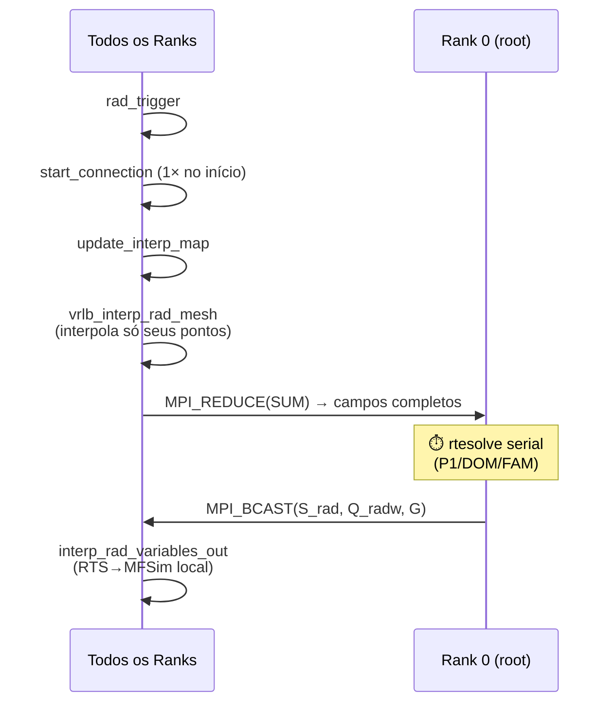
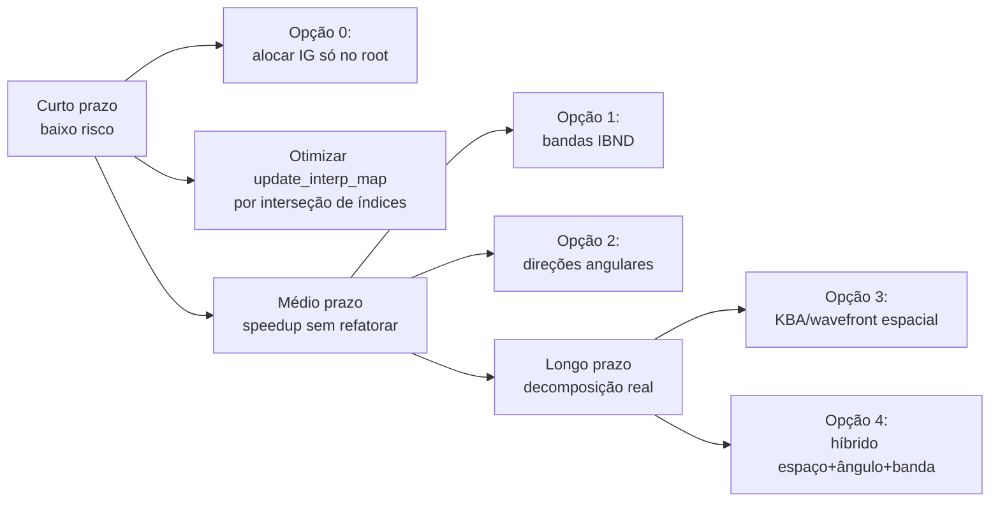
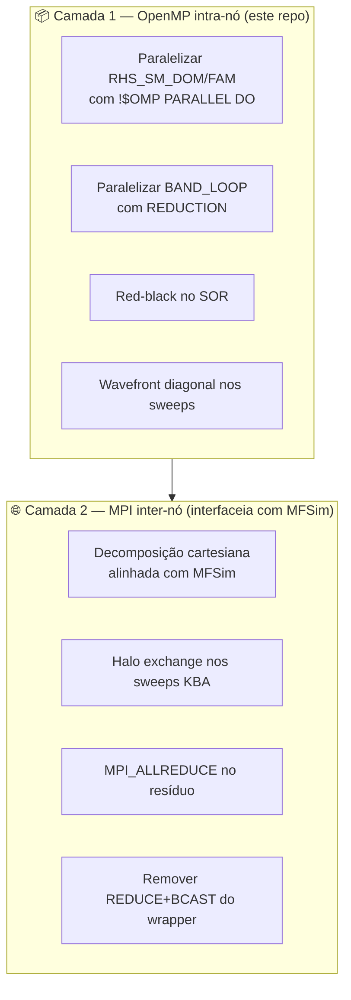

# 02 — Síntese do Relatório MFSim ↔ RTS (MPI)

> Síntese dos dois documentos em `refs/`:
> - **`relatorio_RTS_MFSim_MPI_260308_031011.pdf`** (10/02/2026) — relatório técnico
>   "Acoplamento MFSim–RTS e caminhos de paralelização MPI". Foco em decomposição de
>   domínio e nos métodos FAM/DOM.
> - **`Tese03082023 - gustavo-1.pdf`** (Tese de Doutorado, Gustavo Silva Rodrigues, UFU
>   2023) — fundamentos teóricos do RTS e capítulo 4 sobre acoplamento fluidodinâmica–
>   radiação.
>
> Este documento captura **o que esses PDFs trazem de novo** em relação ao
> [01-arquitetura-atual.md](01-arquitetura-atual.md), com ênfase nas decisões de engenharia
> que vão guiar nossas próximas mudanças no código.

---

## 1. Contexto Real do RTS — não está sozinho

A tese é explícita: o RTS foi projetado para ser **acoplado a um CFD** via *acoplamento solto*
(loose coupling). O CFD que hospeda o RTS na prática é o **MFSim**, desenvolvido pelo grupo
MFLab/UFU.

```
MFSim (paralelo MPI + AMR)
   └── src_term/RTS/                ← wrapper de integração
         ├── rad_core.f90           ← rad_trigger (ponto de entrada)
         ├── RTS_connection.f90     ← inicialização, leitura de input.rts
         ├── rad_interface.f90      ← mapeamento/interpolação MFSim↔RTS
         └── rad_parallel.f90       ← (experimental, não usado)
                │
                └── chama o RTS deste repositório
                       (sources/RTS_*.f90 sem modificação)
```

Como o RTS é incluído **íntegro** dentro do MFSim, qualquer modificação que façamos nos
arquivos `sources/RTS_*.f90` será automaticamente refletida no acoplamento — não há código
RTS duplicado.

---

## 2. Estado Atual da Paralelização

### 2.1 Quem está paralelo, quem não está

| Componente | Paralelismo atual | Observação |
|------------|-------------------|------------|
| MFSim (fluidodinâmica) | ✅ MPI + AMR por blocos | já produção |
| Interpolação MFSim→RTS | ✅ MPI parcial | cada rank interpola só seus pontos |
| **Solver RTS (`rtesolve`)** | ❌ **serial, só no root** | ⚠️ gargalo principal |
| Broadcast dos resultados RTS | ✅ MPI_BCAST | obrigatório porque só root resolve |
| `rad_parallel.f90` | ⚠️ incompleto/experimental | tipos com ponteiros não alocados |

### 2.2 Fluxo atual (Figura 1 do relatório)



### 2.3 Quatro gargalos identificados no relatório

| # | Gargalo | Causa |
|---|---------|-------|
| 1 | **Tempo** | `rtesolve` não escala (executa só no root) |
| 2 | **Comunicação** | 1× `MPI_REDUCE` 3D na entrada + 3× `MPI_BCAST` 3D na saída por chamada radiativa |
| 3 | **Memória** | Todos os ranks alocam `IG(nxi,nyi,nzi,nt,np)` — em casos 3D realistas isso explode (vide §5 abaixo) |
| 4 | **Mapeamento de malha** | `update_interp_map` é `O(N_patches × N_pontos_RTS)` |

### 2.4 Estimativa de memória para `IG` (FAM/DOM)

| Caso | nx=ny=nz | nt×np | Memória `IG` por rank |
|------|----------|-------|----------------------|
| pequeno | 64 | 64 (8×8) | ~140 MB |
| médio | 128 | 128 (8×16) | ~2,2 GB |
| grande | 256 | 128 (8×16) | ~18 GB |
| grande non-gray (×nsb=5) | 256 | 128 | **~90 GB** ⚠️ |

> **Em casos 3D grandes, replicar `IG` em todo rank é inviável.** A decomposição espacial
> deixa de ser apenas "boa ideia" e passa a ser **pré-requisito** para rodar.

---

## 3. As Sete Estratégias do Relatório (Tabela Comparativa)

| Opção | Eixo de paralelismo | Mudança no RTS | Escala típica | Quando vale |
|-------|---------------------|----------------|---------------|-------------|
| **0** | nenhum (só memória) | pequena | nenhuma em tempo | habilita casos maiores root-only |
| **1** | Bandas espectrais (`IBND`) | baixa | até `nsb` (≈5) | non-gray (WSGG); zero ganho no cinza |
| **2** | Direções angulares (`l,m`) | média | até `nq` ou `nt·np` | muitos ângulos; pesado com espalhamento (ALLREDUCE) |
| **3** ⭐ | **Espaço (i,j,k) — KBA/wavefront** | **alta** | malhas grandes | **alinhado com MFSim — elimina REDUCE+BCAST** |
| **4** | Híbrido (espaço + ângulo + banda) | muito alta | muito alta | clusters grandes |
| **5** | Espaço com "fontes defasadas" (Jacobi) | média | média | evita wavefront, mas piora convergência |
| **6** | Reformular FAM como rays | muito alta | variável | geometrias específicas |
| **7** | MPI shared memory por nó | baixa-média | só memória | medida de transição |

> ⭐ **A Opção 3 é a recomendada pelo relatório** quando o objetivo é decomposição de domínio
> alinhada com o MFSim. Elimina as operações globais (REDUCE+BCAST) e aproveita o
> particionamento que o MFSim já faz.

---

## 4. Recomendação do Relatório — Caminho Incremental



---

## 5. Detalhamento da Opção 3 (KBA/Wavefront) — a Principal

### 5.1 Por que casa naturalmente com o MFSim

Se o particionamento espacial do RTS coincidir com as caixas físicas do MFSim
(limites `a1..b1, a2..b2, a3..b3`):

- **MFSim → RTS:** desnecessário `MPI_REDUCE`. Cada rank interpola só sua parte do RTS e
  já tem o campo local correto.
- **RTS → MFSim:** desnecessário `MPI_BCAST`. Cada rank já tem `S_rad` e `G` no seu
  subdomínio e interpola direto para suas células do MFSim.

### 5.2 O desafio — sweeps dependem do vizinho a montante

Para um dado octante, um rank só pode iniciar a varredura quando receber as intensidades
"de entrada" vindas dos ranks a montante. Em 2D, simplificadamente:

```
P(1,1)  P(2,1)  P(3,1)
P(1,2)  P(2,2)  P(3,2)      ← processos em "diagonais" rodam em paralelo
P(1,3)  P(2,3)  P(3,3)
```

Esse é o padrão clássico **KBA (Koch-Baker-Alcouffe)**, originado em transporte de nêutrons,
e diretamente aplicável aqui.

### 5.3 Esqueleto do sweep paralelo (do relatório)

```fortran
! Dados:
! - MPI Cartesian coords: (px,py,pz)
! - Neighbors: west/east/south/north/bottom/top
! - Subdomínio local: i=i0..i1, j=j0..j1, k=k0..k1 (com halos)
! - Para cada octante: vizinhos upstream dependem de sign(mu,eta,xi)

do iter = 1, ITMAX
   ! 1) Monta Sm local (emissão + espalhamento) para células locais
   call RHS_SM_local(Sm_local, IG_local, ...)

   eps_local = 0.0d0

   do oct = 1, 8
      ! 2) Posta recepções (faces de entrada) vindas dos vizinhos a montante
      call post_Irecv_inflow_planes(oct, ...)

      ! 3) Se for fronteira física, aplica BC de entrada
      call apply_physical_inflow_BC(oct, ...)

      ! 4) Aguarda as dependências de entrada
      call wait_inflow_dependencies(oct, ...)

      ! 5) Sweep no bloco local (ordem de i,j,k depende do octante)
      do each direction d in octant(oct)
         do k in sweep_order_k(oct)
            do j in sweep_order_j(oct)
               do i in sweep_order_i(oct)
                  Ip = IG_local(i,j,k,d)
                  call rad_scheme(IG_local(i-dix,j,k,d), &
                                  IG_local(i,j-diy,k,d), &
                                  IG_local(i,j,k-diz,d), Ip, Iw,Is,Ib)
                  IG_local(i,j,k,d) = update(Iw,Is,Ib,Sm_local(i,j,k,d),...)
                  eps_local = max(eps_local, &
                                  abs(IG_local(i,j,k,d)-Ip)/(IG_local(i,j,k,d)+small))
               end do
            end do
         end do
      end do

      ! 6) Envia faces de saída para vizinhos a jusante
      call Isend_outflow_planes(oct, ...)
   end do

   ! 7) Convergência global
   call MPI_ALLREDUCE(eps_local, eps_global, 1, MPI_DOUBLE, MPI_MAX, MPI_COMM_WORLD, ierr)
   if (eps_global < rad_tol) exit
end do
```

### 5.4 Tamanho das mensagens

Por face entre vizinhos:

```
bytes ≈ 8 × N_face × N_Ω_oct
```

onde:
- `N_face` = células no plano de fronteira (ex.: `nyloc × nzloc`)
- `N_Ω_oct` = ângulos do octante (DOM: `nq`; FAM: ≈`nt·np/8`)

Isso justifica o **híbrido (Opção 4)**: dividir ângulos reduz o tamanho das mensagens.

---

## 6. Checklist Concreto do Relatório

Para chegar numa versão MPI-paralela por domínio, o relatório lista:

### 6.1 Definir subdomínio RTS por processo
- Topologia cartesiana MPI coerente com `npx,npy,npz` do MFSim
- Intervalos locais `(i0..i1)` a partir dos limites físicos do MFSim e do espaçamento do RTS

### 6.2 Refatorar arrays globais para locais
- `T_energy, cappa, sigma, beta, G, S_rad, Q_radw` → campos locais com halo
- `IG` (5D) particionado **no espaço**, idealmente também no ângulo

### 6.3 Comunicação de intensidades nos sweeps
- Por octante, definir quais faces são entrada e quais são saída
- Antes do sweep: `MPI_Irecv` das faces de entrada
- Depois do sweep: `MPI_Isend` das faces de saída
- Ranks de fronteira física: usar BC ao invés de receber

### 6.4 Resíduo e convergência global
- Cada rank calcula `eps_local`
- `MPI_ALLREDUCE(MAX)` → `eps_global` para critério de parada

### 6.5 Acoplamento com MFSim sem operações globais
- Substituir `MPI_REDUCE` por interpolação direta no subdomínio local
- Remover `MPI_BCAST`, interpolar `S_rad/G/Q_radw` localmente

---

## 7. O Que o Relatório Adiciona ao [01-arquitetura-atual.md](01-arquitetura-atual.md)

| Aspecto | Doc 01 (este repo) | Relatório (MFSim) | Conclusão |
|---------|--------------------|--------------------|-----------|
| Escopo | RTS standalone | RTS dentro do MFSim | Os mesmos arquivos `sources/*.f90` aparecem nos dois contextos |
| Estado do paralelismo | "não tem" | "MFSim paralelo, RTS root-only" | RTS é o **único componente** ainda serial |
| Estratégia recomendada | OpenMP primeiro | MPI por decomposição espacial (KBA) | **Pode-se fazer ambos**: OpenMP intra-nó + MPI inter-nó (híbrido) |
| Hot loops | identificados (`RHS_SM_*`, sweeps) | mesmos | confirmado |
| Wavefront/KBA | mencionado como "difícil" | descrito com pseudocódigo completo | temos a receita |
| Tamanho do IG | "preocupante" | **calculado**: até 90 GB/rank em non-gray 256³ | **inegociável** decompor espacialmente em casos grandes |
| `rad_parallel.f90` | desconhecido | "experimental, não validado" | tratar como WIP, não confiar |

### 7.1 O que o relatório **não** cobre e segue como problema nosso

- **Refatoração interna do `SOR`** (P1 e equação da energia) para paralelismo
- **OpenMP** como alternativa/complemento ao MPI (intra-nó)
- **Perfilamento empírico** — nenhum dos PDFs traz medições reais; vão ser nossas
- **Validação numérica** pós-paralelização

---

## 8. Pontos Específicos do Relatório que Viram Tarefas

1. **Otimizar `update_interp_map` por interseção de índices** — antes mesmo de paralelizar
   o solver, esse mapeamento `O(N_patches × N_pontos)` pode ser reduzido drasticamente
2. **Mover `allocate(IG)` para dentro de `if(proc_id==0)`** — economia de memória imediata
   (Opção 0) sem mexer no algoritmo. Mas isso é alteração no wrapper MFSim, não no RTS standalone.
3. **No RTS standalone**, os passos que efetivamente preparam para a decomposição:
   - 3.1. Substituir `MAXVAL`, `SUM` etc. por versões que aceitem dimensões locais
   - 3.2. Trocar `(nxi,nyi,nzi)` por `(nxi_loc, nyi_loc, nzi_loc)` com ghost cells
   - 3.3. Refatorar `agular_loop`/`orthogonal_loop` para receber/enviar planos de borda
   - 3.4. Refatorar `ETANORM` (depende de `MAXVAL(ruling)`) → `MPI_ALLREDUCE(MAX)`
   - 3.5. Refatorar `SOR` (Gauss-Seidel) — opções: red-black, halo + Jacobi-like, ou trocar por CG/GMRES paralelizável

---

## 9. Estratégia Combinada Sugerida

Considerando que **o RTS é incluído inteiro no MFSim**, faz sentido adotar uma estratégia
em duas camadas:



**Por que essa ordem:**
- A Camada 1 traz ganhos imediatos mesmo enquanto o RTS roda só no root (acelera o root)
- A Camada 1 também é a "rede de segurança" — se a Camada 2 atrasar, ainda temos speedup
- A Camada 2 depende de refatoração estrutural (arrays locais, halos, comunicação)
- O resultado final é **híbrido MPI+OpenMP** (Opção 4 do relatório), maximizando uso de
  clusters modernos

---

## 10. Próximas Decisões Pendentes

Para definir antes de começar a codar:

1. **Caso de validação** — qual benchmark de `validation/` usaremos para medir baseline?
   Sugestão: `3D_Hsu_benchmark` (3D realista, gas absorvente, suficientemente caro)
2. **Onde rodar** — desktop multi-core, servidor com N nós, cluster?
3. **Métrica de sucesso** — speedup mínimo aceitável? tempo absoluto-alvo?
4. **Compromisso com o wrapper MFSim** — temos acesso aos arquivos `rad_core.f90`,
   `RTS_connection.f90`, `rad_interface.f90`? Sem isso, paralelizamos o RTS standalone
   mas não conseguimos validar a integração
5. **Caminho do plano de trabalho** — começar pela Camada 1 (OpenMP) ou ir direto à
   refatoração para MPI?

---

## 11. Arquivos de Referência Gerados

Para facilitar futuras buscas:
- [refs/relatorio.txt](../refs/relatorio.txt) — texto extraído do relatório (37 KB)
- [refs/tese.txt](../refs/tese.txt) — texto extraído da tese (363 KB)

Esses `.txt` foram gerados com `pdftotext -layout` e são grepáveis. Os PDFs originais
continuam em `refs/`.

---

*Documento gerado a partir da leitura completa de `relatorio_RTS_MFSim_MPI_260308_031011.pdf`
e dos capítulos relevantes de `Tese03082023 - gustavo-1.pdf`.*
