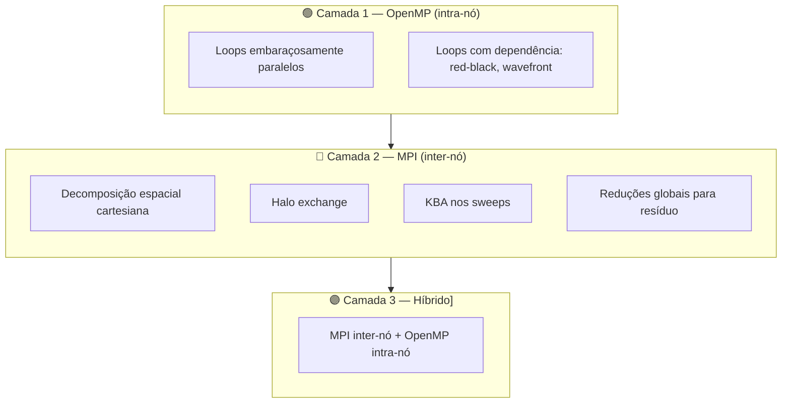
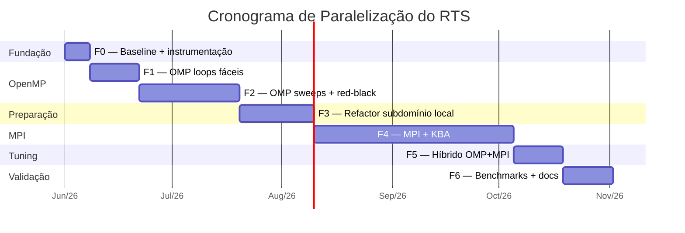

# 04 — Plano de Ataque (Paralelização do RTS standalone)

> **Documento de execução.** Aqui está o roadmap concreto, dividido em fases, para
> paralelizar o solver do RTS. Cada fase tem **objetivo, arquivos afetados, critério de
> aceitação, esforço estimado e riscos**.
>
> Pré-requisitos de leitura: [00-comeca-aqui.md](00-comeca-aqui.md),
> [01-arquitetura-atual.md](01-arquitetura-atual.md),
> [02-relatorio-mfsim-mpi.md](02-relatorio-mfsim-mpi.md),
> [05-casos-de-validacao.md](05-casos-de-validacao.md).

---

## 1. Escopo

### 1.1 O que está incluso

- Refatoração dos arquivos `sources/RTS_*.f90` para suportar paralelismo
- Adição de OpenMP nos loops apropriados
- Adição de MPI com decomposição espacial (KBA/wavefront)
- Validação numérica contra os casos em `validation/`
- Instrumentação e medição de performance

### 1.2 O que NÃO está incluso (fora de escopo)

| Item | Por quê |
|------|---------|
| Refatorar `rad_interface.f90` ("blocão") | Repositório MFSim — papel da equipe deles |
| Refatorar `rad_core.f90`, `RTS_connection.f90` | Repositório MFSim — papel da equipe deles |
| Implementar RadCal, FSCK, SNB | Fora do escopo (modelos de absorção) |
| Versão GPU (CUDA/OpenACC) | Fase muito posterior, se aplicável |
| Suporte a malhas não-estruturadas | Fora do escopo |

### 1.3 Pressupostos

- Temos acesso de escrita ao código em `sources/`
- Temos pelo menos uma máquina multi-core para desenvolvimento
- Para validar MPI: precisamos eventualmente de cluster ou máquina com vários sockets
- Não dependemos de avanços no MFSim para começar — fazemos o RTS "MPI-ready"

---

## 2. Os 3 Problemas Que Vamos Atacar

Recap dos problemas que sobram após excluir o "blocão" (Frente B):

| Problema | Causa estrutural | Como atacamos |
|----------|------------------|---------------|
| 🐢 **Tempo do solver** | Loops `O(N³ · n_ang²)` em série | OpenMP nos loops independentes + MPI nos sweeps |
| 💾 **Memória** | `IG(nxi,nyi,nzi,nt,np)` alocado por inteiro em cada rank | Decomposição espacial: cada rank aloca só sua fatia |
| 📉 **Não escala** | Solver é todo serial | OpenMP intra-nó + MPI inter-nó |

---

## 3. Estratégia em Camadas



**Por que essa ordem:**

1. **OpenMP primeiro** porque traz ganho rápido mesmo sem mexer na estrutura. É a "rede de segurança" — se o MPI atrasar, ainda temos speedup.
2. **MPI depois** porque exige refatoração estrutural (arrays locais, halos, mudança nos sweeps). Mas é o que resolve o problema de memória e escala real.
3. **Híbrido no final** porque só faz sentido depois das duas camadas funcionarem isoladas.

---

## 4. Plano por Fases

> **Estimativas de esforço** são em "semanas-equivalentes" assumindo 1 pessoa em dedicação
> moderada. Multiplicar conforme o time real.

### Fase 0 — Baseline e Instrumentação (foundation)

**Objetivo:** estabelecer pontos de medição e infraestrutura de validação **antes**
de mexer em qualquer coisa. Sem isso, não há como provar que otimização funcionou.

**Esforço:** ~1-2 semanas
**Pré-requisito:** ambiente de build (gfortran + make) funcionando

> 📖 Leia [05-casos-de-validacao.md](05-casos-de-validacao.md) antes desta fase —
> ele cataloga os 8 casos disponíveis em `validation/` e qual cada um testa.

#### Atividades

1. **Compilar e rodar** o RTS atual (serial) sem modificações para confirmar ambiente

2. **Criar infraestrutura de validação automatizada:**
   - `tests/run_validation.sh CASO` — automatiza setup (copia input.rts e user_functions.f90, edita output.rts conforme readme)
   - `tests/compare_fields.py` — compara dois conjuntos de output `.dat` com tolerância configurável (RMS, máx absoluto, relativo)
   - `make validate` no Makefile — roda todos os 8 casos sequencialmente e reporta resultado

3. **Rodar TODOS os 8 casos** de validação na configuração serial atual:
   - `1D_Bordbar_WSGG`, `2D_Goutiere_flame`, `2D_Kim_scattering`, `2D_Shah_solution`
   - `3D_Bordbar_flame`, `3D_Hsu_benchmark`, `3D_Soucasse_cavity`, `symmetry_bc`
   - Salvar todos os outputs em `tests/reference/CASO/` — vão ser nosso "gold standard"

4. **Adicionar timers** nas rotinas principais de `RTS_radiation.f90` e `RTS_solvers.f90`:
   ```fortran
   double precision :: t0, t1
   call cpu_time(t0)
   ! ... rotina ...
   call cpu_time(t1)
   write(*,*) 'tempo XYZ:', t1-t0
   ```
   Pontos a instrumentar: `radiative_properties`, `BAND_LOOP`, `RHS_SM_DOM/FAM`,
   `orthogonal_loop`/`agular_loop`, `SOR`, total do `rtesolve`

5. **Benchmark de performance** — rodar `3D_Hsu_benchmark` em malhas crescentes
   (21³ → 64³ → 128³, e 256³ se RAM permitir). Tabela de tempo total + tempo por rotina.

6. **Documentar tudo em `docs/06-baseline.md`** (será criado nesta fase):
   - Versões de gfortran/make usadas
   - Hardware (CPU, RAM)
   - Tabela: caso × tempo serial × memória pico
   - Tabela: rotina × % do tempo total (perfil)
   - Anotações sobre comportamento observado

#### Arquivos afetados

| Arquivo | Mudança |
|---------|---------|
| [`RTS_radiation.f90`](sources/RTS_radiation.f90) | Adicionar `cpu_time` em pontos-chave |
| [`RTS_solvers.f90`](sources/RTS_solvers.f90) | Adicionar `cpu_time` no `SOR` |
| Novo: `tests/run_validation.sh` | Automação de setup de caso |
| Novo: `tests/compare_fields.py` | Comparação numérica |
| Novo: `tests/reference/*/` | Outputs gold standard |
| [`makefile`](makefile) | Adicionar target `make validate` |
| Novo: `docs/06-baseline.md` | Tabelas de medição |

#### Critério de aceitação

- [ ] Todos os 8 casos de validação rodam end-to-end no serial atual
- [ ] `make validate` passa em todos
- [ ] Outputs de referência salvos em `tests/reference/CASO/`
- [ ] `compare_fields.py` funciona — testar quebrando de propósito (mudar 1 valor) e verificar que detecta
- [ ] Tabela com tempo de cada rotina principal no `3D_Hsu_benchmark` em pelo menos 3 tamanhos
- [ ] `docs/06-baseline.md` documenta tudo

#### Riscos

| Risco | Mitigação |
|-------|-----------|
| Caso de benchmark muito pequeno → tempo de 2s, sinal de speedup nulo | Usar `3D_Hsu_benchmark` em 128³ para benchmark; 21³ só para regressão rápida |
| Diferenças entre máquinas (gfortran 9 vs 10, flags) | Fixar versão e flags no Makefile, documentar no baseline |
| Setup manual de casos consome tempo enorme | Investir no `run_validation.sh` cedo — paga dividendos em todas as fases seguintes |
| Validação WSGG depende da existência dos coeficientes | Confirmar que `WSGG_polynomials` funciona antes (dependência transitiva) |

---

### Fase 1 — OpenMP nos Loops Embaraçosamente Paralelos

**Objetivo:** primeiro speedup, sem mexer em estrutura.
**Esforço:** ~2 semanas
**Pré-requisito:** Fase 0 completa

#### Atividades

1. **Habilitar OpenMP no Makefile**
   ```makefile
   FFLAGS = ... -fopenmp
   # No linker também:
   $(FC) -fopenmp ...
   ```

2. **Paralelizar `RHS_SM_DOM` e `RHS_SM_FAM`** — loops 5D sem dependência:
   ```fortran
   !$OMP PARALLEL DO PRIVATE(i,j,l,ls,m,SMSUM,aux) SCHEDULE(STATIC)
   do k=2,nzp
       ...
   end do
   !$OMP END PARALLEL DO
   ```

3. **Paralelizar `radiative_properties` (WSGG)** — triplo loop espacial célula a célula

4. **Paralelizar `G_DOM`, `G_FAM`** — soma angular por célula, independente entre células

5. **Paralelizar `wall_fluxes_DOM`, `wall_fluxes_FAM`, `wall_fluxes_pone`** — loops 2D nas faces

6. **Paralelizar `BAND_LOOP`** (mais delicado por causa de redução):
   ```fortran
   !$OMP PARALLEL DO PRIVATE(IBND,IGband,Gband,Sband,IBFF) &
   !$OMP&            REDUCTION(+:G,S_rad) SCHEDULE(STATIC)
   BAND_LOOP: do IBND = 1,nsb
       ...
   end do BAND_LOOP
   !$OMP END PARALLEL DO
   ```
   Atenção: `cappa`, `beta` precisam ser tornadas privadas ou refatoradas para arrays
   indexados por banda

7. **Rodar regressão** após cada modificação

#### Arquivos afetados

| Arquivo | Mudança |
|---------|---------|
| [`makefile`](makefile) | Adicionar `-fopenmp` |
| [`RTS_radiation.f90`](sources/RTS_radiation.f90) | Diretivas OpenMP nas rotinas listadas |
| [`RTS_absorption.f90`](sources/RTS_absorption.f90) | Diretivas OpenMP em `radiative_properties` |

#### Critério de aceitação

- [ ] Compila com `-fopenmp` sem warnings de race condition
- [ ] Speedup ≥ **4×** em 8 threads (em FAM 3D non-gray, caso de benchmark)
- [ ] Speedup ≥ **8×** em 16 threads
- [ ] Resultado numérico **bit-a-bit idêntico** ao serial (a maioria das paralelizações
      aqui é determinística; se diferir, pode ser ordem de soma — verificar)
- [ ] Script de regressão verde

#### Riscos

| Risco | Mitigação |
|-------|-----------|
| Race condition em `cappa`/`beta` no `BAND_LOOP` | Tornar locais à iteração ou usar `firstprivate` |
| Speedup pobre por false sharing | Verificar layout de memória, usar `SCHEDULE(STATIC, chunk)` adequado |
| Resultado numérico difere por ordem de soma | Aceitável se for diferença na 14ª casa; se for maior, investigar |

---

### Fase 2 — OpenMP nos Loops Difíceis (sweeps e SOR)

**Objetivo:** atacar os hot loops que têm dependência interna.
**Esforço:** ~3-4 semanas
**Pré-requisito:** Fase 1 funcionando

#### Atividades

1. **Red-black ordering no SOR**
   - Trocar Gauss-Seidel sequencial por padrão "vermelho-preto" (xadrez 3D)
   - Células "vermelhas" (i+j+k par) atualizam usando "pretas"; depois invertem
   - Cada fase é embaraçosamente paralela
   - **Implica mudança numérica** (convergência diferente, pode precisar de mais iterações)

2. **Wavefront diagonal nos sweeps DOM/FAM**
   - Em vez de varrer `(k,j,i)` sequencial, varrer **diagonais** `i+j+k = const`
   - Todas as células da mesma diagonal são independentes
   - Implementação típica: loop externo na diagonal, loop interno paralelizado
   ```fortran
   ! pseudocódigo octante 1
   do diag = 0, (nxp-2)+(nyp-2)+(nzp-2)
     !$OMP PARALLEL DO PRIVATE(i,j,k,...)
     do k = max(2,diag-nxp-nyp+4), min(nzp, diag+2)
        do j = ...
           i = diag - j - k + 6
           if (i in [2,nxp]) then
              ! update IG(i,j,k,l,m)
           end if
        end do
     end do
     !$OMP END PARALLEL DO
   end do
   ```
   - Repetir para cada octante (8×) e cada direção angular (l,m)

3. **Alternativa simples no sweep:** paralelizar só a direção angular `(l,m)` por célula
   - Mais simples mas potencial menor — fica como plano B

#### Arquivos afetados

| Arquivo | Mudança |
|---------|---------|
| [`RTS_solvers.f90`](sources/RTS_solvers.f90) | Refatorar `SOR` para red-black |
| [`RTS_radiation.f90`](sources/RTS_radiation.f90) | Refatorar `orthogonal_loop` e `agular_loop` para wavefront |

#### Critério de aceitação

- [ ] Convergência do SOR similar à atual (talvez 1.2× mais iterações é aceitável)
- [ ] Speedup adicional ≥ **2×** em cima da Fase 1
- [ ] Validação numérica passa em todos os casos de `validation/`

#### Riscos

| Risco | Mitigação |
|-------|-----------|
| Red-black piora convergência demais | Ter SOR sequencial como fallback (flag em runtime) |
| Wavefront é complexo de implementar certo | Começar com versão 2D, testar, depois 3D |
| Validação física diverge | Comparar com benchmark serial: erro absoluto deve estar dentro de `rad_tol` |

---

### Fase 3 — Preparação Estrutural para MPI

**Objetivo:** refatorar o código para que cada rank possa eventualmente trabalhar só com
sua fatia. **Ainda não usa MPI** — só prepara o terreno.
**Esforço:** ~3 semanas
**Pré-requisito:** Fase 1 (Fase 2 opcional)

#### Atividades

1. **Introduzir conceito de "subdomínio local" no `RTS_global.f90`**
   ```fortran
   ! adicionar:
   integer :: nxi_loc, nyi_loc, nzi_loc       ! tamanhos locais
   integer :: i_offset, j_offset, k_offset    ! deslocamento global do meu pedaço
   integer :: my_rank, n_ranks                ! identidade MPI
   integer :: nbr_west, nbr_east, nbr_south, nbr_north, nbr_bottom, nbr_top
   ```
   No serial atual, `nxi_loc = nxi`, `offset = 0`, `n_ranks = 1`, vizinhos = `MPI_PROC_NULL`.
   Isso permite o código compilar e rodar **igual ao atual** mesmo após a refatoração.

2. **Substituir todas as alocações** `(nxi, nyi, nzi)` por `(nxi_loc, nyi_loc, nzi_loc)`
   nas centenas de declarações

3. **Distinguir BC física vs interna no `RTS_bc.f90`**
   - Adicionar flags `is_physical_west`, `is_physical_east`, etc.
   - Hoje todas são `.true.` (caso serial)
   - Quando virar MPI, faces internas serão `.false.` e usarão halo

4. **Refatorar `ETANORM`, `MAXVAL`** para terem versão "global-ready"
   - Pode ser uma macro/função que no serial é `MAXVAL(...)` e no MPI vira `MPI_ALLREDUCE`

5. **Mover I/O para "root-only"**
   - `input_data` em `RTS_input.f90`: só rank 0 lê o arquivo, depois `MPI_Bcast` (no MPI)
   - No serial isso fica como está

#### Arquivos afetados

Quase todos:
- [`RTS_global.f90`](sources/RTS_global.f90)
- [`RTS_start.f90`](sources/RTS_start.f90)
- [`RTS_radiation.f90`](sources/RTS_radiation.f90)
- [`RTS_solvers.f90`](sources/RTS_solvers.f90)
- [`RTS_bc.f90`](sources/RTS_bc.f90)
- [`RTS_energy.f90`](sources/RTS_energy.f90)

#### Critério de aceitação

- [ ] Código compila e roda com mesma performance da Fase 2
- [ ] Resultado numérico idêntico (regressão verde)
- [ ] Variáveis de subdomínio existem (mesmo que com valores triviais)
- [ ] BC física vs interna está abstrata, mesmo que sempre física no serial

#### Riscos

| Risco | Mitigação |
|-------|-----------|
| Refatoração massiva quebra coisas sutis | Commits pequenos, rodar regressão após cada |
| Nomes de variáveis ficam confusos | Convenção clara: sufixo `_loc` para local |

---

### Fase 4 — MPI com Decomposição Espacial (o trabalho pesado)

**Objetivo:** RTS roda em paralelo de verdade, escala em cluster.
**Esforço:** ~6-8 semanas
**Pré-requisito:** Fase 3 obrigatória

#### Atividades

1. **`MPI_Init`/`MPI_Finalize` em `RTS_main.f90`**
   - Em modo standalone, o RTS inicializa MPI
   - Em modo acoplado ao MFSim, MFSim já inicializou — usar `MPI_Initialized` para detectar

2. **Topologia cartesiana** em `RTS_start.f90`
   ```fortran
   call MPI_Cart_create(MPI_COMM_WORLD, 3, [Px,Py,Pz], &
                        [.false.,.false.,.false.], .true., RTS_COMM, ierr)
   call MPI_Cart_coords(RTS_COMM, my_rank, 3, my_coords, ierr)
   call MPI_Cart_shift(RTS_COMM, 0, 1, nbr_west, nbr_east, ierr)
   ! ... etc para y e z
   ```

3. **Calcular subdomínio de cada rank**
   ```fortran
   nx_loc = nx / Px + (1 if my_coords(1) < mod(nx, Px) else 0)
   i_offset = ... ! deslocamento global
   nxi_loc = nx_loc + 2  ! +2 para halo
   ```

4. **Halo exchange para campos auxiliares** (`T_energy`, `cappa`, `sigma`, ...)
   - Após inicialização e a cada update
   - 6 trocas (oeste, leste, sul, norte, fundo, topo)
   - `MPI_Sendrecv` com buffer das faces

5. **KBA nos sweeps DOM/FAM** — o core do trabalho
   - Para cada octante, identificar quais 3 faces são "entrada" (upstream) e quais 3 são "saída"
   - `MPI_Irecv` posts antes do sweep
   - `MPI_Wait` antes de processar células próximas à face
   - `MPI_Isend` após processar células próximas à face de saída
   - Iterar sobre as 8 octantes (cada um define ordem de varredura diferente)
   - Pseudocódigo detalhado em [02-relatorio-mfsim-mpi.md §5.3](02-relatorio-mfsim-mpi.md)

6. **Resíduo global**
   ```fortran
   call MPI_ALLREDUCE(eps_local, eps_global, 1, MPI_DOUBLE_PRECISION, &
                      MPI_MAX, RTS_COMM, ierr)
   if (eps_global < rad_tol) exit
   ```

7. **SOR distribuído**
   - Cada iteração: halo exchange + computação local + ALLREDUCE no resíduo
   - Pode ficar lento (muitas comunicações pequenas) — considerar trocar por CG com pré-condicionador local

8. **I/O paralelo**
   - Opção simples: cada rank salva `output_rankNNN.vtk`, juntar com ParaView
   - Opção melhor: MPI-IO escrevendo um único `.vtk` paralelo (.pvtk)

#### Arquivos afetados

- [`RTS_main.f90`](sources/RTS_main.f90) — MPI_Init/Finalize
- [`RTS_start.f90`](sources/RTS_start.f90) — topologia, subdomínio
- [`RTS_radiation.f90`](sources/RTS_radiation.f90) — **maior mudança**: sweeps KBA
- [`RTS_solvers.f90`](sources/RTS_solvers.f90) — SOR distribuído + reduções
- [`RTS_bc.f90`](sources/RTS_bc.f90) — diferenciar faces físicas vs internas
- [`RTS_output.f90`](sources/RTS_output.f90) — I/O paralelo

Novo arquivo sugerido:
- `RTS_mpi.f90` — módulo isolando todas as operações MPI (init, halo, sweeps inter-rank)

#### Critério de aceitação

- [ ] Roda com 1 rank (≡ serial) com resultado idêntico
- [ ] Roda com 8 ranks distribuídos (2×2×2) com resultado **dentro da tolerância** do serial
- [ ] Memória por rank cai aproximadamente linearmente com nº de ranks
- [ ] Speedup ≥ **8×** em 16 ranks (em caso 3D grande)
- [ ] Passa em todos os casos de `validation/`

#### Riscos

| Risco | Mitigação |
|-------|-----------|
| KBA é complexo, fácil errar ordens | Implementar octante por octante, validando contra serial |
| Performance ruim por wavefront serial (poucos ranks por face) | Combinar com OpenMP intra-rank na Fase 5 |
| Decadência de convergência do SOR | Trocar por CG/GMRES paralelizado |
| Bug numérico sutil | Comparar campo a campo no benchmark, não só fluxo total |

---

### Fase 5 — Híbrido OpenMP + MPI

**Objetivo:** combinar as duas camadas para extrair máximo dos clusters modernos.
**Esforço:** ~2 semanas
**Pré-requisito:** Fases 2 e 4 funcionando

#### Atividades

1. **Validar coexistência** — compilar com `-fopenmp` + `-lmpi`, rodar com
   `mpirun -n 4 ... OMP_NUM_THREADS=8` (4 ranks × 8 threads = 32 cores)
2. **Tunar layout** — geralmente 1 rank por socket NUMA + threads no socket
3. **Garantir thread-safety nas comunicações MPI** — usar `MPI_THREAD_FUNNELED` (só thread mestre faz MPI) ou superior conforme necessidade
4. **Profiling** — verificar se há sobreposição comunicação/computação (Score-P ou ferramentas similares)

#### Critério de aceitação

- [ ] Speedup total maior que MPI puro ou OpenMP puro isolados
- [ ] Sem deadlocks ou race conditions

#### Riscos

| Risco | Mitigação |
|-------|-----------|
| Conflito entre OpenMP e MPI | Usar `MPI_THREAD_FUNNELED` por simplicidade |
| Carga desbalanceada | Profiling, ajustar mapeamento |

---

### Fase 6 — Validação Completa e Benchmarks

**Objetivo:** documentar o trabalho final com números reais.
**Esforço:** ~2 semanas
**Pré-requisito:** Fase 4 (Fase 5 ideal)

#### Atividades

1. **Rodar todos os casos de `validation/`** e comparar com:
   - Resultado serial original
   - Resultados publicados na tese
2. **Curva de speedup**: tempo vs nº de cores (1, 2, 4, 8, 16, 32, 64, ...)
3. **Curva de eficiência paralela**: speedup / nº de cores
4. **Análise de escalabilidade fraca**: dobra problema E dobra cores → tempo constante?
5. **Análise de memória**: GB por rank em cada configuração
6. **Documentar tudo** em `docs/06-benchmarks.md`

#### Critério de aceitação

- [ ] Todos os benchmarks da tese reproduzidos dentro da tolerância
- [ ] Tabela completa de speedup
- [ ] Identificação clara do "limite de escala" (até onde escala bem)

---

## 5. Ferramentas Necessárias

| Ferramenta | Para que | Fase |
|-----------|----------|------|
| `gfortran` ≥ 10 | Compilação | todas |
| `make` | Build system | todas |
| `mpif90` (OpenMPI ou MPICH) | MPI | 4+ |
| `gprof` ou `perf` | Profiling básico | 0+ |
| `Score-P` ou `Tau` (opcional) | Profiling paralelo avançado | 5+ |
| `ParaView` | Visualizar VTK | 0+ |
| `numpy` + script Python | Comparar campos numéricos | 0+ |
| Acesso a cluster (eventual) | Validar MPI em escala | 4+ |

---

## 6. Casos de Validação

**Temos 8 casos em [`validation/`](../validation)** — todos benchmarks publicados na
literatura com solução de referência conhecida. Catálogo completo em
[05-casos-de-validacao.md](05-casos-de-validacao.md).

### 6.1 Estratégia em duas vias

| Uso | Casos | Frequência |
|-----|-------|-----------|
| **Regressão numérica** (correto?) | todos os 8 com malhas padrão | a cada commit relevante |
| **Benchmark de performance** (rápido?) | `3D_Hsu_benchmark` em malhas crescentes (21³→256³) | ao fim de cada fase |

### 6.2 Por que `3D_Hsu_benchmark` é o benchmark principal

- 3D (exercita os 8 octantes)
- FAM (caminho de código mais caro)
- Absorção e espalhamento **espacialmente variáveis** (impossível otimizar com simplificações)
- Geometria simples (cavidade 1m³) → fácil escalar malha mantendo o problema físico
- Solução Monte Carlo publicada → oráculo de alta precisão

### 6.3 Tamanhos para benchmark de performance

| Tamanho | nx=ny=nz | Tempo serial estimado | Memória `IG` (FAM 32 dir) |
|---------|----------|----------------------|---------------------------|
| Default validação | 21 | segundos | ~3 MB |
| Pequeno (dev) | 64 | minutos | ~70 MB |
| Médio (benchmark padrão) | 128 | dezenas de min | ~550 MB |
| Grande (estresse) | 256 | horas | ~4 GB |

Começar com 21³ (dev rápido), validar com 64³, benchmark final no 128³ ou 256³.

### 6.4 Cobertura por caso

Cada caso exercita combinações diferentes de método/modelo/dimensão. **Rodar todos
cobre virtualmente todos os caminhos de código** (ver §5 de [05-casos-de-validacao.md](05-casos-de-validacao.md)).

---

## 7. Métricas de Sucesso

### 7.1 Métricas duras

| Métrica | Meta Fase 1 (OpenMP) | Meta Fase 4 (MPI) |
|---------|---------------------|-------------------|
| Speedup (16 cores) | ≥ 8× | ≥ 12× |
| Speedup (64 cores) | n/a | ≥ 30× |
| Eficiência paralela (16 cores) | ≥ 50% | ≥ 70% |
| Memória por rank (256³, 64 ranks) | n/a | ≤ 2 GB |
| Validação numérica | passa todos | passa todos |

### 7.2 Métricas qualitativas

- [ ] Código continua legível
- [ ] Testes de regressão automatizados
- [ ] Documentação atualizada
- [ ] Comentários nas seções não-óbvias (wavefront, KBA, halo)

---

## 8. Riscos Estratégicos

| Risco | Probabilidade | Impacto | Mitigação |
|-------|--------------|---------|-----------|
| Bug numérico sutil só aparece em escala | Média | Alto | Testes incrementais (1→2→4→8→16 ranks), comparação campo a campo |
| Convergência do SOR degrada | Alta | Médio | Plano B: trocar por CG paralelo |
| Wavefront/KBA escala mal em muitos ranks | Média | Médio | Hibridizar com OpenMP intra-nó |
| Acesso à máquina/cluster atrasa Fase 4 | Média | Alto | Adiantar Fases 1-3 que rodam em desktop |
| Mudanças quebram integração futura com MFSim | Baixa (se manter API) | Alto | Não mexer no nome das rotinas públicas (`rtesolve`, etc.) |
| Pessoa-chave sai do projeto | n/a | Alto | Documentação contínua |

---

## 9. Cronograma Sugerido



**Total: ~22 semanas (~5 meses)** assumindo 1 pessoa em dedicação razoável.

> Ajustar conforme o time real. Em paralelo (2 pessoas) pode cair para ~3 meses.

---

## 10. Próximos Passos Imediatos

Para começar **hoje**, na ordem:

1. **Validar ambiente:** confirmar que `gfortran` + `make` compilam o RTS atual
2. **Rodar a configuração padrão** (`input/input.rts` atual) e ver se sai output em `output/`
3. **Criar branch** `paralelizacao` no git para o trabalho
4. **Implementar `tests/run_validation.sh`** — automatizar setup de um caso (começar com `3D_Hsu_benchmark`)
5. **Rodar todos os 8 casos** com o script e gerar `tests/reference/CASO/`
6. **Adicionar timers** nas rotinas hot (lista em §4 Fase 0)
7. **Cronometrar `3D_Hsu_benchmark`** em 21³, 64³, 128³
8. **Documentar tudo** em `docs/06-baseline.md`

A partir daí, atacar cada fase em sequência, mantendo as docs em paralelo.

---

## 11. O Que Cada Doc Vai Capturar (futuro)

Documentos já existentes:

| Doc | Conteúdo | Status |
|-----|----------|--------|
| [`00-comeca-aqui.md`](00-comeca-aqui.md) | Onboarding para programadores sem background em radiação | ✅ |
| [`01-arquitetura-atual.md`](01-arquitetura-atual.md) | Mapa completo do código atual | ✅ |
| [`02-relatorio-mfsim-mpi.md`](02-relatorio-mfsim-mpi.md) | Síntese do relatório do MFSim | ✅ |
| [`04-plano-de-ataque.md`](04-plano-de-ataque.md) | Este documento | ✅ |
| [`05-casos-de-validacao.md`](05-casos-de-validacao.md) | Catálogo dos casos em `validation/` | ✅ |

Conforme as fases avançam, novos docs vão capturar o que foi feito:

| Doc | Conteúdo | Fase associada |
|-----|----------|----------------|
| `06-baseline.md` | Medições atuais (tempo, memória, perfil) | F0 |
| `07-openmp-fase1.md` | Implementação e resultados da OpenMP "fácil" | F1 |
| `08-openmp-fase2.md` | Red-black e wavefront | F2 |
| `09-refactor-local.md` | Refatoração para subdomínio local | F3 |
| `10-mpi-decomposicao.md` | MPI propriamente dito (KBA) | F4 |
| `11-hibrido.md` | OMP + MPI combinados | F5 |
| `12-benchmarks.md` | Curvas finais de speedup, comparação com tese | F6 |

Cada um vai ter: o que mudou no código, antes/depois de performance, problemas encontrados, decisões tomadas.

---

*Documento vivo. Atualizar conforme as fases avançam e decisões são revistas.*
