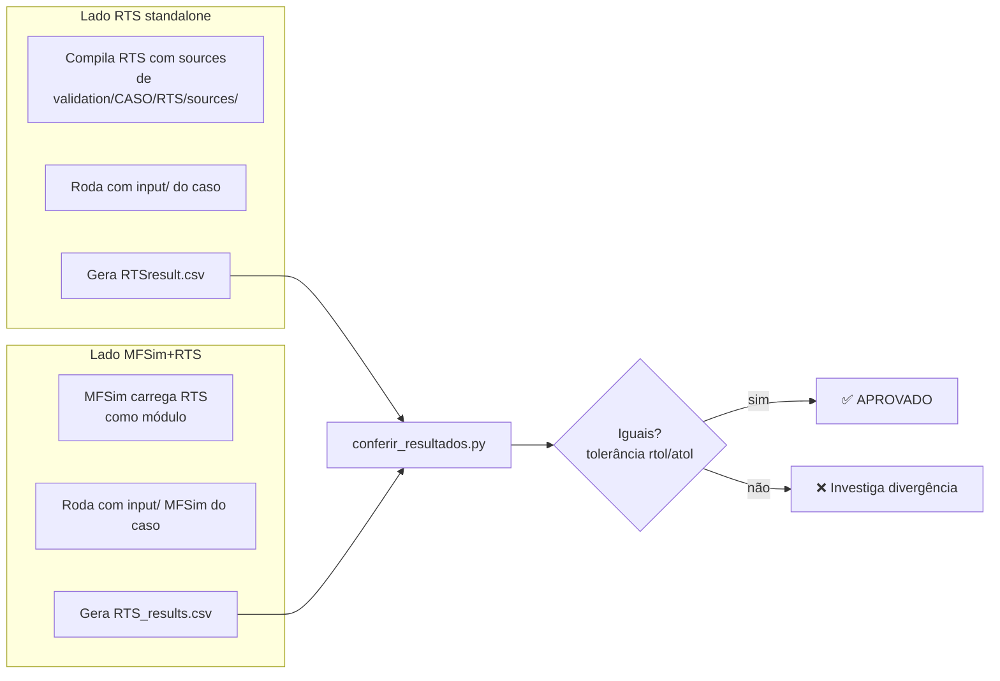

# 05 — Catálogo de Casos de Validação

> Inventário detalhado dos casos em [`validation/`](../validation), como cada um está
> organizado, qual é o workflow de comparação MFSim ↔ RTS, e como vamos usá-los no
> trabalho de paralelização.
>
> **Versão atualizada após reorganização** (a estrutura mudou completamente em relação
> à versão anterior — cada caso agora tem subpastas `RTS/` e `MFSim/`).
>
> Pré-requisitos: [00-comeca-aqui.md](00-comeca-aqui.md),
> [04-plano-de-ataque.md](04-plano-de-ataque.md).

---

## 1. Para Que Servem

Os casos em `validation/` servem **dois propósitos**:

1. **Validação física do RTS** contra benchmarks publicados na literatura (Hsu, Bordbar, Kim, Shah, Goutiere, Soucasse).
2. **Validação da integração MFSim+RTS** — garantir que o RTS embarcado no MFSim produz o mesmo resultado que o RTS standalone.

Cada caso vem com **dois setups paralelos** (`RTS/` e `MFSim/`) e ferramentas para comparar os outputs dos dois lados.

---

## 2. Estrutura Pós-Reorganização

```
validation/
│
├── README.md                       (a criar — documenta workflow)
├── conferir_resultados.py          ★ script de comparação (USAR ESSE)
├── convert_fractions.py            helper: X (molar) → Y (massa)
├── teste_1D_bordbar.py             plota T analítica do caso 1D
├── validados.txt                   lista do que já foi validado
│
├── 1D_Bordbar/
│   ├── amr3d.cfg                   caminhos absolutos (do dev original)
│   ├── RTS/
│   │   ├── input/                  *.rts (configs do RTS)
│   │   ├── sources/                ⚠️ RTS embarcado COM feature CSV
│   │   └── output/                 CSVs gold standard
│   └── MFSim/
│       ├── input/                  *.amr3d + *.f90 (configs MFSim)
│       └── output/                 CSVs gold standard + *.log
│
├── 2D_Goutiere/                    (mesma estrutura)
├── 2D_Kim/
├── 2D_Shah/
├── 3D_Bordbar/                     (+ post_proc/ extra)
├── 3D_Hsu/
├── 3D_Soucasse/                    (maior caso, ~44 MB)
└── demonstrations/
    └── symmetry_bc/                ⚠️ formato legado, só com input.rts
```

**Tamanho atual:** ~99 MB total (era 177 MB antes da limpeza).

---

## 3. Catálogo dos 7 Casos Ativos

| Caso | Dim | Malha (RTS) | Método | Modelo | Espalhamento | Gás | T não-uniforme | Validado |
|------|-----|-------------|--------|--------|--------------|-----|----------------|----------|
| [`1D_Bordbar`](#41-1d_bordbar) | 1D | 30 | FAM | non-gray WSGG | — | CO₂/H₂O | sim | ✅ |
| [`2D_Goutiere`](#42-2d_goutiere) | 2D | 21×21×21 | FAM | non-gray WSGG | — | CO₂/H₂O | sim | ✅ |
| [`2D_Kim`](#43-2d_kim) | 2D | 25×25×25 | FAM | gray | anisotrópico | — | parede S=64.8K | ✅ |
| [`2D_Shah`](#44-2d_shah) | 2D | 21×21×2 | FAM | gray | isotrópico | — | uniforme | ⚠️ não listado |
| [`3D_Bordbar`](#45-3d_bordbar) | 3D | 17×34×17 | FAM | non-gray WSGG | — | CO₂/H₂O (0.85/0.10) | sim | ✅ |
| [`3D_Hsu`](#46-3d_hsu) ⭐ | 3D | 21×21×21 | FAM | gray | isotrópico | — | uniforme, κ não-uniforme | ✅ |
| [`3D_Soucasse`](#47-3d_soucasse) | 3D | 42×42×42 | FAM | gray | — | — | sim, ε=0.5 | ❌ não listado |
| [`demonstrations/symmetry_bc`](#48-demonstrationssymmetry_bc) | 3D | 20×20×20 | FAM | gray | — | — | uniforme, BCs simetria | — (demo) |

> Os "✅" vêm do `validation/validados.txt`. **`3D_Soucasse` e `2D_Shah` não aparecem
> nessa lista**, então status indefinido — provavelmente em validação ou pendente.

---

## 4. Casos Detalhados

### 4.1 `1D_Bordbar`

**Referência:** Bordbar et al. (2020), [DOI 10.1016/j.icheatmasstransfer.2019.104400](https://doi.org/10.1016/j.icheatmasstransfer.2019.104400)

**O que testa:** modelo **WSGG não-cinza** estendido em problema 1D.

**Setup:**
- Dimensão: **1D** (mas no `input.rts` tem `nx=30, ny=40, nz=20` — só x é ativo)
- Geometria física: `1m × 4m × 2m`
- Método: FAM (`nt=4, np=8` → 32 ângulos)
- WSGG ativo, CO₂=1e-4, H₂O=0.5, P=101.325 kPa
- Temperatura: **não-uniforme** (T(x) = 400 + 1400·sin²(πx) — ver [`teste_1D_bordbar.py`](../validation/teste_1D_bordbar.py))
- Paredes: WEST/EAST a 400K, demais a 300K
- κ = 10 m⁻¹

**Por que importa para nós:**
- Único caso 1D — exercita `DIMEN == 1`
- Loop de bandas WSGG (5 bandas) ativo
- Caso barato pra regressão rápida

---

### 4.2 `2D_Goutiere`

**Referência:** Goutiere et al. (2000), [DOI 10.1016/S0022-4073(99)00102-8](https://doi.org/10.1016/S0022-4073(99)00102-8)

**O que testa:** WSGG 2D em recinto retangular.

**Setup:**
- Dimensão: **2D** (`21×21`, profundidade 0.5m)
- Método: FAM
- WSGG ativo, CO₂=0.1, H₂O=0.2
- Temperatura não-uniforme via `user_functions.f90`
- κ = 10 m⁻¹
- Paredes todas a 0K (idealização)

---

### 4.3 `2D_Kim`

**Referência:** Kim & Lee (1988), [DOI 10.1016/0017-9310(88)90283-9](https://doi.org/10.1016/0017-9310(88)90283-9)

**O que testa:** **espalhamento anisotrópico**.

**Setup:**
- Dimensão: 2D (`25×25`)
- Método: FAM
- Sem gás (`gas_prop = .false.`)
- κ = 0, **σ = 1** (espalhamento puro)
- **`aniso_flag = .true.`** + fase Linear F1
- Parede SOUTH a 64.8K (irradiando), demais a 0K

**Por que importa para nós:**
- **Único caso com espalhamento anisotrópico ativo** — testa `RHS_SM_FAM` no caminho mais caro (somatório duplo angular O(N³·n²))

---

### 4.4 `2D_Shah`

**Referência:** Shah, N.G. (1979) — PhD Thesis, Imperial College London. [Handle 10044/1/7839](http://hdl.handle.net/10044/1/7839)

**O que testa:** absorção/emissão clássica em recinto 2D (sem espalhamento, sem gás).

**Setup:**
- Dimensão: 2D (`21×21`, com `nz=2` e `lz=1mm` — espessura mínima)
- Método: FAM
- Sem gás
- κ = 1, σ = 0
- T uniforme 64.8K
- Paredes a 0K

**Curiosidade:** este caso usa `nz=2` em vez de `nz=1` — sutileza de discretização que pode merecer documentação no código.

---

### 4.5 `3D_Bordbar`

**Referência:** Bordbar et al. (2014), [DOI 10.1016/j.combustflame.2014.03.013](https://doi.org/10.1016/j.combustflame.2014.03.013), originalmente Liu (1999).

**O que testa:** WSGG 3D em geometria de chama alongada (2×4×2 m), oxi-combustão.

**Setup:**
- Dimensão: 3D (`17×34×17`)
- Método: FAM
- WSGG ativo, CO₂=0.85, H₂O=0.10 (rico em CO₂)
- Temperatura não-uniforme via `user_functions.f90`
- κ = 10 m⁻¹
- Paredes a 300K

**Particularidades:**
- Único caso com pasta extra `post_proc/` (CSVs filtrados, ~6 MB — uso ainda a confirmar)
- Único caso com `MFSim/postProc/` contendo um `comp_rts.py` alternativo

---

### 4.6 `3D_Hsu` ⭐

**Referência:** Hsu & Farmer (1997), [DOI 10.1115/1.2824087](https://doi.org/10.1115/1.2824087)

**O que testa:** cavidade cúbica com **absorção e espalhamento não-uniformes**. Resultado de referência via Monte Carlo (alta precisão).

**Setup:**
- Dimensão: 3D cúbica (1m³, malha `21×21×21`)
- Método: FAM
- Sem gás
- T uniforme 64.8K
- **κ e σ não-uniformes** (via `user_functions.f90`):
  ```
  κ(x,y,z) = 0.9·(1-2|x-0.5|)(1-2|y-0.5|)(1-2|z-0.5|) + 0.1
  σ(x,y,z) = 0.9·κ(x,y,z)
  ```
- Paredes a 0K

**Por que é o BENCHMARK PRINCIPAL DE PERFORMANCE:**
- 3D real exercitando todos os 8 octantes
- Geometria simples (cubo 1m³) → trivial escalar a malha (21³ → 64³ → 128³ → 256³)
- Solução Monte Carlo conhecida → oráculo confiável
- Campos contínuos (definidos por função) → resultado físico igual em qualquer resolução

**Tamanhos para benchmark de performance:**

| nx=ny=nz | Tempo serial estimado | Memória `IG` (FAM 32 dir) |
|----------|----------------------|---------------------------|
| 21 (default) | segundos | ~3 MB |
| 64 | minutos | ~70 MB |
| 128 | dezenas de min | ~550 MB |
| 256 | horas | ~4 GB |

---

### 4.7 `3D_Soucasse`

**Referência:** Soucasse et al. (2014), [DOI 10.1615/ComputThermalScien.2012005118](https://doi.org/10.1615/ComputThermalScien.2012005118)

**O que testa:** cavidade cúbica com **paredes não-negras** (ε=0.5) e T não-uniforme.

**Setup:**
- Dimensão: 3D cúbica (1m³, malha `42×42×42` — maior dos casos)
- Método: FAM
- Sem gás (gray)
- κ = 1
- T não-uniforme via `user_functions.f90`
- **Paredes com emissividade 0.5** (única configuração assim entre os casos)

**Por que importa para nós:**
- Testa o caminho de `epsilon_rad` (paredes não-negras → reflexão difusa nos contornos)
- Malha intermediária 42³ ≈ 74k células — bom para benchmarks "real-life" sem precisar escalar

---

### 4.8 `demonstrations/symmetry_bc`

**Referência:** demonstração interna, sem paper.

**O que testa:** **condições de contorno de simetria**.

**Setup:**
- Dimensão: 3D (0.5m³, malha `20³`)
- Método: FAM
- Sem gás, T uniforme 64.8K, κ=10
- **Paredes EAST, SOUTH, BOTTOM com `SBCwall = .true.`** (simetria)

**Status:** mantido no formato legado (só `input.rts`, sem subpastas `RTS/` e `MFSim/`).

---

## 5. Workflow de Validação MFSim ↔ RTS

A grande mudança é que agora cada caso testa **a integração**, não apenas o RTS isolado.

### 5.1 Fluxo conceitual



### 5.2 Script de comparação — `conferir_resultados.py`

Já existe em [`validation/conferir_resultados.py`](../validation/conferir_resultados.py).
**Não precisa criar nada.** Apenas adaptar.

**O que ele faz:**
- Lê `RTSresult.csv` (lado RTS) e `RTS_results.csv` (lado MFSim)
- Remove células de borda (ghost cells) para não comparar onde não há solução real
- Usa `pd.testing.assert_frame_equal(rtol=..., atol=...)` para falhar se erro > tolerância
- Tem três variantes: `compare_csv_1D`, `compare_csv_2D`, `compare_csv_3D`

**Tolerâncias atuais (do código):**
- 3D, 2D: `rtol=1e-5, atol=1e-8`
- 1D: `rtol=1e-12, atol=1e-8`

**Limitação atual:** o caminho está **hardcoded** em `ROOT = "/home/ophir/MFLab/validacoes_RTS"`.
Para usar no nosso ambiente: ou exportar via variável, ou criar um wrapper.

### 5.3 Outros utilitários Python

| Arquivo | Função |
|---------|--------|
| [`teste_1D_bordbar.py`](../validation/teste_1D_bordbar.py) | Plota a função analítica T(x) = 400 + 1400·sin²(πx) — só pra inspeção visual |
| [`convert_fractions.py`](../validation/convert_fractions.py) | Converte frações molares X → frações mássicas Y (necessário porque MFSim usa massa e RTS usa molar) |

---

## 6. ⚠️ Pegadinhas Conhecidas

### 6.1 Sources do RTS estão **diferentes** entre raiz e cada caso

Os arquivos `validation/CASO/RTS/sources/RTS_*.f90` **NÃO são iguais** ao `sources/` raiz.
Os embeds contêm uma **feature extra** que falta no raiz:

- Flag `csv_flag` em `RTS_global.f90`
- Leitura no `RTS_input.f90`
- Subroutine `csv_save` (~100 linhas) em `RTS_output.f90`
- Ajuste de `dy` default em `RTS_start.f90`

**Implicação:** o `sources/` raiz **não consegue gerar os CSVs** que o
`conferir_resultados.py` precisa. Para executar a validação MFSim↔RTS hoje, é preciso
compilar a partir dos sources embarcados de cada caso, **não** do `sources/` raiz.

**Decisão pendente:** promover essa feature ao `sources/` raiz e eliminar os embeds.
Discutido como Fase A no [04-plano-de-ataque.md](04-plano-de-ataque.md).

### 6.2 `amr3d.cfg` tem caminhos absolutos

Cada caso tem um `amr3d.cfg` com paths como:
```
input_path: "/home/ophir/MFLab/validacoes_RTS/1D_Bordbar/input"
```

Esses paths **só funcionam no ambiente original** (servidor MFLab). Para rodar em
outro lugar, precisa reescrever todos os `amr3d.cfg`.

### 6.3 Makefiles foram removidos dos casos

Durante a reorganização, os `makefile` duplicados em `validation/*/RTS/` foram
deletados (eram iguais ao da raiz). Para compilar a partir dos sources de um caso:

```bash
cd validation/1D_Bordbar/RTS/
make -f ../../../makefile
```

Ou copiar o makefile raiz para o caso, ou criar um symlink.

### 6.4 `2D_Shah` usa `nz=2`, não `nz=1`

A discretização 2D no `2D_Shah` usa `nz=2` (com `lz=1mm`) em vez de `nz=1`. Possível
sutileza de discretização que outros casos não têm.

### 6.5 Pastas extras em `3D_Bordbar`

Único caso com:
- `post_proc/` (raiz do caso) — 6 MB de CSVs filtrados
- `MFSim/postProc/` — `comp_rts.py` (versão alternativa do `conferir_resultados.py`)
- `MFSim/output/T_energy.csv` e `wah.csv` — outputs que outros casos não têm

Foi mantido pendente "descobrir o uso depois".

---

## 7. Cobertura de Caminhos do Código

| Funcionalidade | Casos que exercitam |
|---------------|---------------------|
| `DIMEN == 1` | `1D_Bordbar` |
| `DIMEN == 2` | `2D_Kim`, `2D_Shah`, `2D_Goutiere` |
| `DIMEN == 3` | `3D_Hsu`, `3D_Bordbar`, `3D_Soucasse`, `symmetry_bc` |
| `nongray_flag = .true.` (WSGG) | `1D_Bordbar`, `2D_Goutiere`, `3D_Bordbar` |
| `nongray_flag = .false.` (gray) | `2D_Kim`, `2D_Shah`, `3D_Hsu`, `3D_Soucasse`, `symmetry_bc` |
| `aniso_flag = .true.` | `2D_Kim` |
| `gas_prop = .true.` | os 3 WSGG (`1D_Bordbar`, `2D_Goutiere`, `3D_Bordbar`) |
| BCs simetria (`SBCwall`) | `symmetry_bc` |
| Paredes não-negras (ε ≠ 1) | `3D_Soucasse` (ε=0.5) |
| Campo κ não-uniforme | `3D_Hsu` |
| Campo T não-uniforme (`user_functions`) | quase todos exceto `3D_Hsu` e `symmetry_bc` |

> **Conclusão:** rodar todos cobre praticamente todos os caminhos. Para regressão rápida,
> `1D_Bordbar` + `3D_Hsu` é um subset enxuto e representativo.

---

## 8. Como Vamos Usar por Fase do Plano

| Fase | Casos usados | Propósito |
|------|--------------|-----------|
| **F0 baseline** | todos (regressão) + `3D_Hsu` escalado (benchmark) | Gerar referências, medir tempos |
| **F1 OpenMP fácil** | `3D_Hsu` (rápido), depois todos antes de fechar | Regressão rápida no dev, completa antes de merge |
| **F2 OpenMP difícil** | todos (especialmente `3D_Bordbar` que estressa WSGG) | SOR/wavefront podem ter pequena diferença — verificar tolerância |
| **F3 refactor local** | todos | Refatoração estrutural — testar tudo |
| **F4 MPI** | `3D_Hsu` em vários tamanhos + todos antes de fechar | Validar com 1, 2, 4, 8, 16 ranks |
| **F5 híbrido** | `3D_Hsu` grande (128³+) | Benchmark de escala |
| **F6 benchmarks** | todos + variações de tamanho | Tabela final |

---

## 9. Tolerâncias por Tipo de Mudança

Sugestão para o `conferir_resultados.py` conforme avançamos:

| Tipo de mudança | rtol | atol |
|-----------------|------|------|
| OpenMP em loops sem dependência | 1e-12 | 1e-15 (≈ bit-a-bit) |
| OpenMP em `BAND_LOOP` com REDUCTION | 1e-10 | 1e-13 |
| Red-black SOR | 1e-6 | 1e-9 |
| MPI sem mudança algorítmica | 1e-10 | 1e-13 |
| MPI com KBA wavefront | 1e-8 | 1e-11 |

Tolerâncias atuais do script: `rtol=1e-5, atol=1e-8` (3D/2D) — bem permissivas, talvez
até demais. Vale apertar conforme refinamos.

---

## 10. Status de Validação (do `validados.txt`)

```
VALIDADOS:
* 3D BORDBAR
* 3D HSU
* 3D BORDBAR     ← duplicado (cinza/non-gray?)
* 2D HSU         ← caso 2D não documentado, talvez seja typo de 2D KIM
* 2D KIM
* 2D GOUTIERE
* 1D BORDAR      ← typo de BORDBAR
```

**Casos não listados como validados:**
- `2D_Shah` — não aparece. Status: confirmar com a equipe.
- `3D_Soucasse` — não aparece. Status: provavelmente em validação ainda.
- `symmetry_bc` — é demo, não precisa.

---

## 11. Action Items para Fase 0

Quando começarmos o trabalho:

1. **Adaptar `conferir_resultados.py`** — substituir `ROOT = "/home/ophir/..."` por path
   relativo ou variável de ambiente
2. **Criar `tests/run_validation.sh`** — automatizar:
   - cd no caso
   - compilar com sources embarcados (até feature CSV ser promovida)
   - rodar
   - chamar `conferir_resultados.py`
3. **Decidir sobre feature CSV** — promover ao raiz ou não (Fase A do plano)
4. **Documentar tempos atuais** em `docs/06-baseline.md`
5. **Confirmar status de validação** dos casos `2D_Shah` e `3D_Soucasse`

---

*Documento atualizado após reorganização da pasta `validation/` (de ~177 MB → ~99 MB).*
